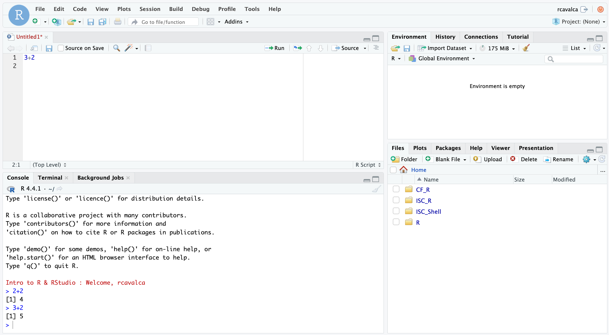

<style type="text/css">

body, td {
   font-size: 16px;
}
code.r{
  font-size: 12px;
}
pre {
  font-size: 12px
}

</style>

```{r klippy, echo=FALSE, include=TRUE}
klippy::klippy(lang = c("r", "markdown", "bash"), position = c("top", "right"))
```

```{r, 'chunk_options', include=FALSE}
source("../bin/chunk-options.R")
knitr_fig_path("01-")
```

```{r, include = FALSE}
source("../bin/set_values.R")
```

# Objectives

- Introduce R and RStudio.
- Learn how to read in a csv file.
- Discuss object naming conventions and types.
- Discuss functions and parameters.
- Learn how to get help with functions.
- Get comfortable with errors and asking for help.

# What is R and RStudio?

In these lessons we'll use the [gapminder dataset](https://www.gapminder.org/) to explore the relationship between a country's life expectancy and the total value of its finished goods and services, also known as the Gross Domestic Product (GDP). To explore this relationship we need **data** and a **platform to analyze the data**. 

We could explore the data with a spreadsheet program like Excel or Google Sheets, but it would be cumbersome to record the steps used to explore and make changes to the original data. Instead, we'll use a programming language to explore and summarize the data. In particular we'll use R and RStudio to create tabular summaries of the data as well as plots.

We'll use R because it is:

- Open source, meaning it's free!
- Widely used, meaning it has a large community of support to get help.
- Powerful, meaning it has many packages that extend and customize its abilities.

We'll also use R because this is a precursor workshop to RNA-seq Demystified, which will teach you how to use R for differential expression analysis.

To get started, we'll use [RStudio](https://posit.co/products/open-source/rstudio/), an integrated development environment (IDE). It acts as a graphical interface to R that has many helpful features, as we'll see. Note that R and RStudio are different, but complimentary. You need R to use RStudio.

# The gapminder dataset

We will be using a dataset from [gapminder](https://www.gapminder.org/) which contains life expectancy, GDP, and population for countries around the world from 1952 to 2007. It is sufficiently rich to allow us to explore data manipulation and visualization in R. We'll begin with data just from 1997, and will expand to the full 1952 - 2007 dataset towards the end. The following is a preview of the data we'll be working with:


# Orienting on RStudio

To get started, let's log in to the workshop server by going here: [`r rstudio_server_url`](`r rstudio_server_url`){target="blank"}

The login page for the server looks like:


Enter your user credentials and click <kbd>Sign In</kbd>. The RStudio interface should load and look like:


**Checkpoint**

RStudio is an integrated development environment where you can write, execute, and see the results of your code. The interface is arranged in different panes:

- The **Console pane** along the left where you can enter commands and execute them.
- The **Environment pane** in the upper right shows any variables you have created, along with their values.
- The pane in the lower right has a few functions:
    - The **Files tab** let's you navigate the file system.
    - The **Plots tab** displays any plots from code run in the Console.
    - The **Help tab** displays the documentation of functions.

## Commands in the Console

Commands can be run in the Console directly. Press <KBD>Enter</KBD> to execute them:

~~~
> 2+2
[1] 4
~~~


**Checkpoint**

## Commands in the Script

Commands can also be run in a script. Some beenefits to using a script rather than relying on the Console pane:

- Scripts are files that can be shared.
- Scripts record the steps taken to analyze the data.
- Scripts can be re-run, allowing for reproducibility.

When first opening RStudio, a script file is not automatically opened. We'll create our script file by clicking on the icon in the upper-left of the interface (a blank piece of paper with a + sign), and selecting <KBD>R Script</KBD>.


 The new pane that opens is the **Source pane**:


You can think of this as a simple text editor. In the Script pane, enter:

~~~
3+2
~~~

Notice that if we press <KBD>Enter</KBD> in the Source pane, we get a new line instead of running the code. In order to execute the code, we press <KBD>Ctrl + Enter</KBD> either on the single line we want to run, or on a highlighted block of code. We then see that code executed, along with its result in in the Console pane.



## Summary: Console vs Script

Here are some of the key differences between the Console and Script panes in RStudio:

| Console          | Script            |
|:-----------------|:------------------|
| Ephemeral code        | Preserved code         |
| Run with <KBD>Enter</KBD> | Run with <KBD>Ctrl + Enter</KBD> |                  |
| Hard to share    | Easy to share     |

## Configuring RStudio

All of the panes in RStudio have configuration options. For example, you can minimize/maximize a pane or resize panes by dragging the borders. The most important customization options for pane layout are in the <KBD>View</KBD> menu. Other options such as font sizes, colors/themes, and more are in the <KBD>Tools</KBD> menu under <KBD>Global Options</KBD>.

We can enable soft-wrapping of code by selecting <KBD>Code</KBD> and then <KBD>Soft Wrap Long Lines</KBD>.


# Workshop flow

To accomodate learning styles and to keep us moving along, we'll provide code in three different ways, and you can get that code into RStudio in corresponding ways:

| Source of Code   | Execution of Code |
|:-----------------|:------------------|
| Zoom screen share            | Type the code yourself.                            |
| Slack            | Copy and paste code into RStudio.                  |
| Website          | Use code block copy button and paste into RStudio. |

**Questions?**

# Setting up

Before we begin, the folder structure of a working directory / project organizes all the relevant files. Typically we make directories for the following types of files:

- Raw data, called `data`, `input`, etc,
- Results, often `results` or `output` with subfolders for `tables`, `figures`, and `rdata`, and
- Scripts, often `scripts`.

We've already provided the raw data in the `data/` folder, but you'd otherwise want to move the starting, unaltered, data into this folder.

## Creating directory stucture

Before we start creating directories, let's make sure we're in the right location. To print the current working directory:

```{r getwd}
# =========================================================================
# Determine and set working directory
# =========================================================================

# -------------------------------------------------------------------------
# Get current working directory
getwd()
```

This means that any references to files loaded or files saved **is with respect to this location**. This can simplify our code a bit by allowing us to use relative paths rather than full paths. Let's set our working directory to the IRR folder in our respective home directories.

```{r setwd, eval = FALSE}
# -------------------------------------------------------------------------
# Set current working directory
setwd('~/IRR')
```

Now that we're sure of our working directory, let's create some folders for our analysis scripts and results thereof.

```{r create_structure}
# =========================================================================
# Create directory structure
# =========================================================================

dir.create('scripts', recursive = TRUE, showWarnings = FALSE)
dir.create('results/figures', recursive = TRUE, showWarnings = FALSE)
dir.create('results/tables', recursive = TRUE, showWarnings = FALSE)
dir.create('results/rdata', recursive = TRUE, showWarnings = FALSE)

# -------------------------------------------------------------------------
```

## Saving scripts

Let's save our currently open script in the `scripts/` folder as `IRR_day1.R` by clicking <KBD>File</KBD> and then <KBD>Save</KBD>.

**Checkpoint**

# Getting started

Out of the box, R has a number of useful functions, but its power lies in extending its functionality with packages / libraries. You can think of libraries as collections of functions organized around a particular functionality. For example, the `tidyverse` package is a collection of packages that are designed to work together to make data manipulation and visualization easier. In order to gain access to functions in a package, we need to load the package into our R session.

## Loading Libraries

Let's begin with loading `tidyverse` since that's the package we'll use for the rest of the workshop.

```{r, 'load_tidyverse', message = TRUE, warning = TRUE}
# =========================================================================
# Load the tidyverse package

library(tidyverse)
```

> ## Note: Package loading messages {.unlisted .unnumbered}
>
> Loading a package can result in a lot of feedback from R. These aren't necessarily errors, but give more information about the result of loading the package. The output tells us which packages were loaded (note that `tidyverse` is sort of a meta-package of packages). The first section of the output states which packages were lodaed and their versions. The second section notes "Conflicts" that occur because the name of a function is used multiple times. So `dplyr::filter() masks stats::filter()` means that the `dplyr` library and the `stats` library have functions called `filter()`, and that when calling `filter()`, the `dplyr` version will be the default.
<br>

**Checkpoint**

## Loading a csv file

Let's jump right in and load some of the gapminder data using the `read_csv()` function:

```{r, 'load_gm97_display', eval = FALSE}
gm97 = read_csv('data/gapminder_1997.csv')
```

```{r, 'load_gm97', echo = FALSE}
gm97 = read_csv('../data/gapminder_1997.csv')
```

Remember, with the cursor on this line we can click <KBD>Run</KBD>, or we can type <KBD>Ctrl</KBD>+<KBD>Enter</KBD>. We should see some output in the Console pane as well as `gm97` in the Environment pane. We'll explore the resulting data in later lessons.

**Checkpoint**

Let's break down this command:

- `gm97` is the **variable name** we're giving to the data we read in.
- `=` is the **assignment operator** which assigns the object on the right to the name on the left.
- `read_csv()` is a **function** in `tidyverse` that reads CSV files.
- `data/gapminder_1997.csv` is the **argument** to `read_csv()` that specifies the file to read.

The output of `read_csv()` in the Console pane gives information such as the dimensions of the data, the delimiter of the file, and how the columns of the data were interpreted.

> ## Note: The assignment operator {.unlisted .unnumbered}
>
> You may have seen another assignment operator, `<-`, which is idiosyncratic to R. We leave as an exercise to the learner to look up the edge cases of when to use `<-` vs `=`. For now, we will use `=` as the assignment operator, which is more common in other programming languages.
<br>

# Basic R data types

In the output of `read_csv()`, the `country` and `continent` columns were intepreted as character strings (`chr`) and the `year`, `pop`, `lifeExp`, and `gdpPercap` columns were interpreted as numbers (`dbl`). This begs the question of the data types available in R. The basic data types in R are:

| Mode (abbreviation) | Type of data | Example |
|:----|:-----|:----|
| Numeric (num) | Decimals, integers, etc. | `1.0`, `3.14`, `-2.5`, `10`, etc. |
| Character (chr) | Sequence of letters or numbers. | `"Hi"`, `'Hi'`, `"1"`, etc. |
| Factor (fct) | Categorical values. | Months of the year. |
| Logical | Boolean values | `TRUE`, `FALSE`, `T`, `F`, etc. |

# Assigning values to objects

Throughout this workshop we'll be assigning names to objects and manipulating them. The names we give to objects can either make our lives easier or harder. Let's start by describing good practices, and then we'll give some examples of bad practices.

## The good

- Use brief, descriptive names.
- Separate words with underscores.

```{r, 'assign_objects'}
name = 'Ben'
name
age = 26
age
name = 'Harry Potter'
name
```

## The bad

- No spaces.
- Don't start with numbers.
- Don't use proteted names, like `if`, `else`, `for`, etc. (see [here](https://stat.ethz.ch/R-manual/R-devel/library/base/html/Reserved.html) for complete list).

```{r, 'bad_object_assignments1', error = TRUE}
favorite number = 12
```

```{r, 'bad_object_assignments=2', error = TRUE}
1number = 3
```

## Be mindful

- Object names are **case-sensitive**. This means that `name`, `Name`, and `NAME` are three distinct objects. Imagine what confusion you could create!
- Words in object names can also be separated by camelCase (e.g. `objectName`), but **be consistent**.

```{r, 'mindful_assignments', error = TRUE}
Flower = 'marigold'
Flower
flower = 'rose'
flower
```

```{r, 'camelCase_assignments', error = TRUE}
favoriteNumber = 12
favoriteNumber
```

Notice that with each assignment, the object appears in the Environment pane. Also notice that by assigning `name` twice, the value becomes the last assigned value, overwriting our initial assignment. Also notice that if we evaluate the name of an object, it is printed in the Console pane. **We will use this pattern repeatedly.**

**Checkpoint**

# Calling functions

Earlier we ran the code `gm97 = read_csv('data/gapminder_1997.csv')`. As we said before, `read_csv()` is a function and `'data/gapminder_1997.csv'` is an argument to that function. What happens if we just do:

```{r, 'bad_function_call', error = TRUE}
read_csv()
```

We get an error in the Console pane. The key part of the message is "argument 'file' is missing, with no default". In other words, this function needs to be told what to read because there is no default.

Not every function needs arguments, but many do. Try the following functions:

```{r, 'function_calls'}
Sys.Date()
getwd()
round(3.1415, 2)
```

Notice that we threw in `round()` which actually takes two arguments. How could we have known that?

## Getting help with functions

When a function is unfamiliar, we'll often look at the manual page for the function to understand what arguments are required, what it does, and what it outputs. By prepending a `?` in front of a function name, you can access the manual page.

~~~
?round
~~~

The help page for `round()` tells us the function does essentially what we'd expect, and gives some other related functions. Note also that the arguments section gives us the names of the arguments and what is expected of them. There is often a Details section to describe nuances, and a Value section to describe the output. Finally, there is an Examples section which gives examples of how to run the code.

## Arguments

When we called `round(3.1415, 2)` it seemed like the first argument is the thing we want to round, and the second argument is how many digits we want. That tracks when we look at `?round`. R can evaluate arguments of a function based on their **position**, as we just saw. However, the preferred way to call a function is to use the names of the arguments, as in:

```{r, 'named_args'}
round(x = 3.14159, digits = 2)
```

Calling a function, and using named arguments, increases the readability of the code and reduces the chance of error, especially with complex functions having many arguments.

# Searching for functions

Prepending a `?` in front a function name to find out more about the function requires knowing the name of the function beforehand. That won't always be the case so there are a couple ways to search for R functions.

1. Search the internet for "R function that does X".
2. Use `help.search()`, as in `help.search('Chi-squared test')`

Note that in the results of `help.search()` we see things like, `stats::chisq.test`. Here the `::` is R notation for `package_name::function`.

**Checkpoint**

# Errosr happn

We already assigned some variables that resulted in errors. There will be plenty of more of those to come; they're a normal part of coding and they are an opportunity to learn! To that end, let's make some mistakes together.

```{r 'error_example1', eval = FALSE}
# Example of not closing quotes
read_csv('data/gapminder_1997.csv)
```

```{r, 'error_example2', eval = FALSE}
# Example of not closing parentheses
round(3.1415, 2
```

In both cases, the Console displays a `+` to indicate that R is waiting for more input. To get out of this state, we can press <KBD>Esc</KBD>, and try again.

## Handling errors

The key to correcting errors is understanding what went wrong. Sometimes R can help, while other times it seems willfully obtuse.

1. Immediately check the spelling of the command; **most errors are caused by typos**.
2. Read the error message to try to understand what might have gone wrong.
3. Check that the objects going into the function are what you expect.

If you're still stuck as to why an error occurred (something we all encounter), reach out for help. For the workshop, please post the question in Slack with the following information:

1. The exact command that caused the error.
2. The exact error message that resulted.

This way we'll more quickly be able to diagnose the problem.

# Base R and the tidyverse

If you've used R before, you may have learned commands that are different what we'll learn in this workshop. We'll focus on functions from the `tidyverse`, a collection of R packages designed to work well together and and offer many features that aren't part of a fresh install of R (that is, "base R"). Generally the `tidyverse` helps us write code that is easy to read and maintain, as we'll see.

The `tidyverse` is geared for data in the form of tables, and it is **very good** at manipulating, summarizing, and visualizing such data. However, data occurs in a variety of other shapes and forms. In particular, in a bioinformatics context, the Bioconductor repository of packages utilize data types that are not tables, and therefore do not always work well with `tidyverse` functions. We'll see clearer examples of this in the RNA-seq Demystified workshop, and you will undoubtedly encounter many examples in the future.

Some people ask "Should I learn tidyverse or base R?" and we think that rather than either/or, it's better to think of both/and. Knowing base R and its approach will help in some contexts, while knowing `tidyverse` will help in others.

# Cheatsheets!

The `tidyverse` packages have excellent cheatsheets that describe the functionality and usage of the packages. You can find them in RStudio by going to the “Help” menu and selecting “Cheat Sheets”. The two that will be most helpful in this workshop are “Data Visualization with ggplot2” and “Data Transformation with dplyr”.

<br/>
<br/>
<hr/>
| [Previous lesson](bash-06-organization.html) | [Top of this lesson](#top) | [Next lesson](r-02-exploration-dplyr.html) |
| :--- | :----: | ---: |

