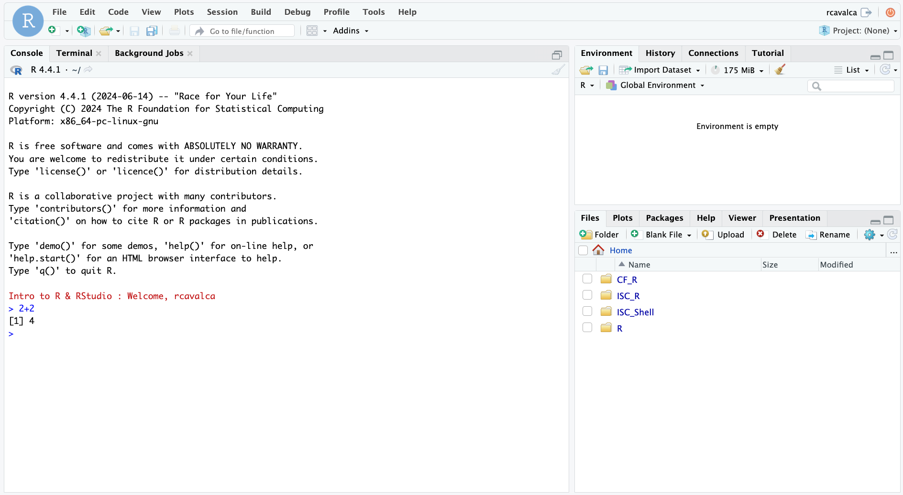
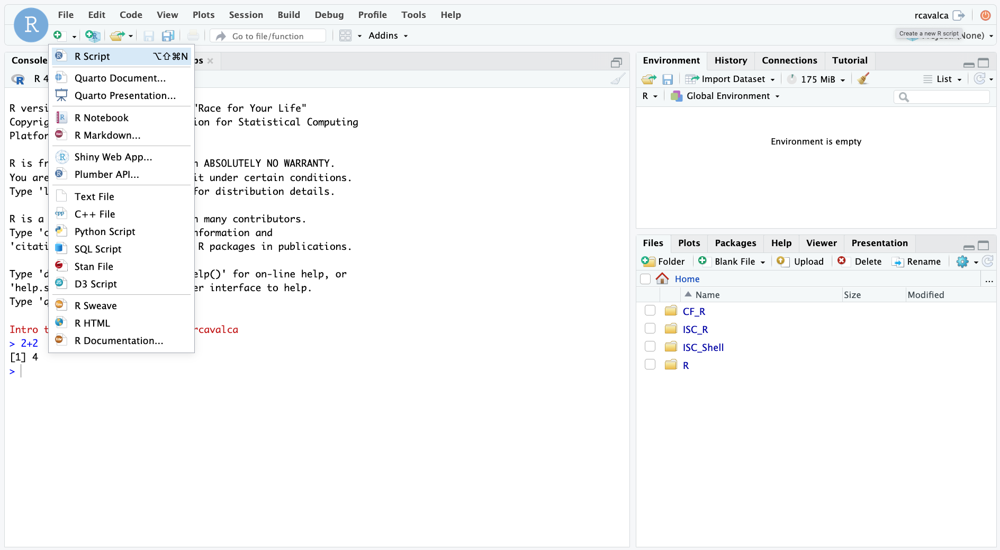
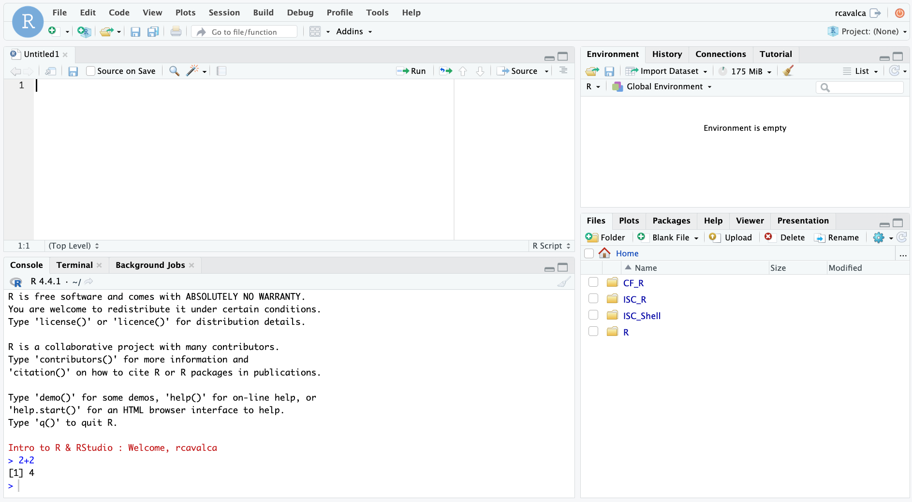
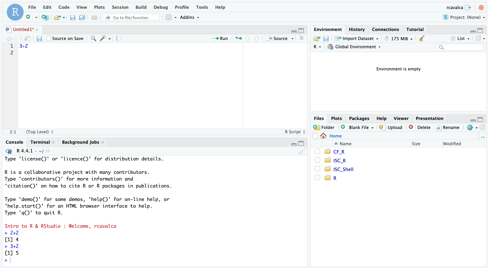

<style type="text/css">

body, td {
   font-size: 16px;
}
code.r{
  font-size: 12px;
}
pre {
  font-size: 12px
}

</style>

```{r klippy, echo=FALSE, include=TRUE}
klippy::klippy(lang = c("r", "markdown", "bash"), position = c("top", "right"))
```

```{r, 'chunk_options', include=FALSE}
source("../bin/chunk-options.R")
knitr_fig_path("01-")
```

```{r, include = FALSE}
source("../bin/set_values.R")
```

# Objectives

- Introduce R and RStudio.
- Discuss data types and object assignment.
- Learn how to read in a csv file.
- Discuss functions and parameters.
- Learn how to get help with functions.
- Get comfortable with errors and asking for help.

# The RStudio interface

RStudio is an integrated development environment where you can write, execute, and see the results of your code. The interface is arranged in different panes:

- The **Console pane** along the left where you can enter commands and execute them.
- The **Environment pane** in the upper right shows any variables you have created, along with their values.
- The pane in the lower right has a few functions:
    - The **Files tab** let's you navigate the file system.
    - The **Plots tab** displays any plots from code run in the Console.
    - The **Help tab** displays the documentation of functions.

## Commands in the Console

Working directly in the console is working directly with R. Commands can be entered and run with the <KBD>Enter</KBD> key:

~~~
> 2+2
[1] 4
~~~



**Checkpoint**

## Commands in a Script

Instead of entering commands directly into the Console, we'll record them in and run them from a script. Some benefits to recording your code in a script include:

- Scripts **linearly** record the steps taken to analyze data.
- Scripts can be re-run, allowing for reproducibility.
- Scripts are can be shared.

We'll create a script file by clicking on the icon in the upper-left of the interface (a blank piece of paper with a + sign), and selecting <KBD>R Script</KBD>.



 The new pane that opens is the **Source pane**, and you can think of it as a text editor:



Code entered in a script file **must explicitly be sent to the Console for execution** with the <KBD>Ctrl + Enter</KBD> command. Enter the following command into the script file and execute it with <KBD>Ctrl + Enter</KBD>:

~~~
3+2
~~~

Looking in the Console we see the executed line and its result. Note that pressing <KBD>Enter</KBD> in the script creates a new line and does not execute the code as in the Console.



## Console vs Script

The key differences between the Console and Script panes in RStudio:

| Console          | Script            |
|:-----------------|:------------------|
| Reset across sessions | Preserved across sessions |
| Run with <KBD>Enter</KBD> | Run with <KBD>Ctrl + Enter</KBD> |
| Quick, exploratory    | Recorded, directed     |

# Data types

We encounter various types of data in our lives. A computer thinks about free text, structured text, numbers, etc. as different types as well. In R, as in many other programming languages, these basic data types are the building blocks of more complex data structures.

| Mode (abbreviation) | Type of data | Example |
|:----|:-----|:----|
| Numeric (num) | Decimals, integers, etc. | `1.0`, `3.14`, `-2.5`, `10`, etc. |
| Character (chr) | Sequence of letters or numbers. | `"Hi"`, `'Hi'`, `"1"`, etc. |
| Factor (fct) | Categorical values. | Months of the year. |
| Logical | Boolean values | `TRUE`, `FALSE`, `T`, `F`, etc. |

# Object assignment

Computation is powerful because it allows us to procedurally process data, and to use those outputs as inputs for further analysis. To do that, we assign values to named **objects** using the `=` operator:

```{r, 'assign_objects'}
# -------------------------------------------------------------------------
# Assigning values to objects

age = 26
age
wizard_name = 'Tom Riddle'
wizard_name
wizard_name = 'Harry Potter'
wizard_name
```

Notice a few things. Each object appears in the Environment pane after assignment. Assigning to `wizard_name` a second time overwrites the first value — the object holds the most recent assignment. Evaluating the name of an object prints its value in the Console. **We will use this pattern repeatedly.**

## Naming objects

Some practices make object names easier to work with:

- Use brief, descriptive names.
- Separate words with underscores.
- Object names are **case-sensitive** — `name`, `Name`, and `NAME` are three distinct objects.

Some things will cause errors:

- No spaces in names.
- Names cannot start with a number.
- Don't use reserved words like `if`, `else`, `for`, etc. (see [here](https://stat.ethz.ch/R-manual/R-devel/library/base/html/Reserved.html) for the complete list).

> ## Exercise {.unlisted .unnumbered}
>
> Create at least four objects in your script, one of each data type from the table above. Choose any names and values you like. Run your code with <KBD>Ctrl + Enter</KBD> and verify the objects appear in the Environment pane.
<br>

**Checkpoint** — Did anyone get an error? Let's take a look.

# Errosr happn

Errors are a completely normal part of coding and they are an opportunity to learn. Let's look at a few common ones.

```{r, 'bad_object_assignments1', error = TRUE}
# -------------------------------------------------------------------------
# Error: variable name with a space

favorite number = 12
```

```{r, 'bad_object_assignments2', error = TRUE}
# -------------------------------------------------------------------------
# Error: variable name beginning with a number

1number = 3
```

```{r, 'error_example1', eval = FALSE}
# -------------------------------------------------------------------------
# Example of not closing quotes

read_csv('data/gapminder_1997.csv)
```

```{r, 'error_example2', eval = FALSE}
# -------------------------------------------------------------------------
# Example of not closing parentheses

round(3.1415, 2
```

In the last two cases, the Console displays a `+` to indicate that R is waiting for more input. To get out of this state, press <KBD>Esc</KBD> and try again.

## Handling errors

The key to correcting errors is understanding what went wrong. Sometimes R can help, while other times it seems willfully obtuse.

1. Immediately check the spelling of the command; **most errors are caused by typos**.
2. Read the error message to try to understand what might have gone wrong.
3. Check that the objects going into the function are what you expect.

If you're still stuck, reach out for help. For the workshop, please post the question in Slack with the following information:

1. The exact command that caused the error.
2. The exact error message that resulted.

This way we'll more quickly be able to diagnose the problem.

# Building a data.frame

Individual objects are useful, but data often has structure — multiple observations of multiple variables. In R, the natural way to represent tabular data is a `data.frame`. Let's build one together using names and birth months from people in the workshop:

```{r, 'build_df_display', eval = FALSE}
# -------------------------------------------------------------------------
# Build a data.frame from participant names and birth months

workshop_data = data.frame(
  name         = c("Alice", "Bob", "Carol"),
  birth_month  = c(3, 11, 7)
)
workshop_data
```

```{r, 'build_df', echo = FALSE}
workshop_data = data.frame(
  name         = c("Alice", "Bob", "Carol"),
  birth_month  = c(3, 11, 7)
)
workshop_data
```

The `c()` function **combines** values into a vector — the building block of a column in a `data.frame`. Notice that `name` is a character column and `birth_month` is numeric, consistent with the data types we discussed earlier.

**Checkpoint**

# Loading libraries

In practice, we almost never enter data by hand. Data usually lives in files, and reading those files well is where R's package ecosystem really shines. Out of the box, R has a number of useful functions, but its power lies in extending its functionality with packages. You can think of packages as collections of functions organized around a particular task. The `tidyverse` is a collection of packages designed to work together to make data manipulation and visualization easier.

In order to use functions from a package, we first need to load it into our R session:

```{r, 'load_tidyverse', message = TRUE, warning = TRUE}
# -------------------------------------------------------------------------
# Load the tidyverse package

library(tidyverse)
```

> ## Note: Package loading messages {.unlisted .unnumbered}
>
> Loading a package can result in a lot of feedback from R. These aren't necessarily errors, but give more information about the result of loading the package. The output tells us which packages were loaded (note that `tidyverse` is sort of a meta-package of packages). The first section of the output states which packages were loaded and their versions. The second section notes "Conflicts" that occur because the name of a function is used multiple times. So `dplyr::filter() masks stats::filter()` means that the `dplyr` library and the `stats` library both have functions called `filter()`, and that when calling `filter()`, the `dplyr` version will be the default.
<br>

**Checkpoint**

## Loading a csv file

Now let's use tidyverse's `read_csv()` function to read in some data from a file, rather than typing it in by hand:

```{r, 'load_gm97_display', eval = FALSE}
# -------------------------------------------------------------------------
# Load the gapminder 1997 data

gm97 = read_csv('data/gapminder_1997.csv')
```

```{r, 'load_gm97', echo = FALSE}
gm97 = read_csv('../data/gapminder_1997.csv')
```

With the cursor on this line we can click <KBD>Run</KBD>, or type <KBD>Ctrl</KBD>+<KBD>Enter</KBD>. We should see output in the Console pane as well as `gm97` in the Environment pane. We'll explore this data in later lessons.

**Checkpoint**

Let's break down this command:

- `gm97` is the **variable name** we're giving to the data we read in.
- `=` is the **assignment operator** which assigns the object on the right to the name on the left.
- `read_csv()` is a **function** in `tidyverse` that reads CSV files.
- `'data/gapminder_1997.csv'` is the **argument** to `read_csv()` that specifies the file to read.

The output of `read_csv()` in the Console pane gives information such as the dimensions of the data, the delimiter of the file, and how the columns of the data were interpreted.

> ## Note: The assignment operator {.unlisted .unnumbered}
>
> You may have seen another assignment operator, `<-`, which is idiosyncratic to R. We leave as an exercise to the learner to look up the edge cases of when to use `<-` vs `=`. For now, we will use `=` as the assignment operator, which is more common in other programming languages.
<br>

# Calling functions

Earlier we ran `read_csv()` with a single argument. What happens if we call it with no arguments at all?

```{r, 'bad_function_call', error = TRUE}
# -------------------------------------------------------------------------
# Example of a function that needs arguments to function

read_csv()
```

We get an error. The key part of the message is "argument 'file' is missing, with no default" — in other words, this function needs to be told what to read because there is no default.

Not every function needs arguments, but many do. Try the following:

```{r, 'function_calls'}
# -------------------------------------------------------------------------
# Examples of functions with no required arguments
Sys.Date()
getwd()

# -------------------------------------------------------------------------
# Example of a function with multiple arguments
round(3.1415, 2)
```

Notice that `round()` takes two arguments. How could we have known that?

## Getting help with functions

When a function is unfamiliar, we'll often look at its manual page to understand what arguments are required, what it does, and what it outputs. Prepend a `?` in front of a function name to pull up the manual page:

```{r, 'help', eval = FALSE}
# -------------------------------------------------------------------------
# Put a "?" in front of a function to see its manual page

?round
```

The help page for `round()` tells us the function does essentially what we'd expect, and gives some other related functions. The **Arguments** section gives us the names of the arguments and what is expected of them. There is often a **Details** section to describe nuances, a **Value** section to describe the output, and an **Examples** section at the bottom which is often the first place to look.

## Arguments

When we called `round(3.1415, 2)`, it looked like the first argument is the thing we want to round and the second is how many digits. That tracks with `?round`. R can evaluate arguments of a function based on their **position**, as we just saw. However, the preferred way to call a function is to use the **names** of the arguments:

```{r, 'named_args'}
# -------------------------------------------------------------------------
# Example of named arguments

round(x = 3.14159, digits = 2)
```

Using named arguments increases the readability of the code and reduces the chance of error, especially with complex functions that have many arguments.

# Searching for functions

Prepending `?` to find out more about a function requires knowing the function name beforehand — that won't always be the case. There are a couple ways to search for R functions:

1. Search the internet for "R function that does X".
2. Use `help.search()`, as in `help.search('Chi-squared test')`

Note that in the results of `help.search()` we see things like `stats::chisq.test`. Here `::` is R notation for `package_name::function`.

**Checkpoint**

# Directory structure

Before we begin, the folder structure of a project organizes all the relevant files. Typically we make directories for the following types of files:

- Raw data, called `data`, `input`, etc,
- Results, often `results` or `output` with subfolders for `tables`, `figures`, and `rdata`, and
- Scripts, often `scripts`.

We've already provided the raw data in the `data/` folder, and it's generally a good idea to keep raw data in its own folder.

Let's create some folders for our analysis scripts and results thereof.

```{r create_structure}
# -------------------------------------------------------------------------
# Create directory structure

dir.create('scripts', recursive = TRUE, showWarnings = FALSE)
dir.create('results/figures', recursive = TRUE, showWarnings = FALSE)
dir.create('results/tables', recursive = TRUE, showWarnings = FALSE)
dir.create('results/rdata', recursive = TRUE, showWarnings = FALSE)
```

# Saving scripts

Let's save our currently open script by clicking <KBD>File</KBD> and then <KBD>Save</KBD>. Double click the `scripts/` folder and enter the file name `IRR.R`.

**Checkpoint**

# Summary

We introduced the interface of RStudio, learned about different data types and how to combine them in data frames, how to read data in to R, discussed functions generally and the idea of parameters, and got comfortable making errors and looking to documentation for help.

<br/>
<br/>
<hr/>
| [Previous lesson](bash-06-organization.html) | [Top of this lesson](#top) | [Next lesson](r-02-exploration-dplyr.html) |
| :--- | :----: | ---: |
