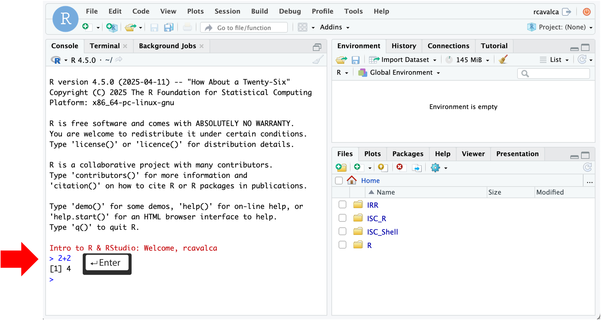

<style type="text/css">

body, td {
   font-size: 16px;
}
code.r{
  font-size: 12px;
}
pre {
  font-size: 12px
}

</style>

```{r klippy, echo=FALSE, include=TRUE}
klippy::klippy(lang = c("r", "markdown", "bash"), position = c("top", "right"))
```

```{r, 'chunk_options', include=FALSE}
source("../bin/chunk-options.R")
knitr_fig_path("01-")
```

```{r, include = FALSE}
source("../bin/set_values.R")
```

# Objectives

- Introduce R and RStudio.
- Learn how to read in a csv file.
- Discuss object naming conventions and types.
- Discuss functions and parameters.
- Learn how to get help with functions.
- Get comfortable with errors and asking for help.

# Introduction to R and RStudio

In these lessons we'll use the [gapminder dataset](https://www.gapminder.org/) to explore the relationship between a country's life expectancy and the total value of its finished goods and services, also known as the Gross Domestic Product (GDP). To explore this relationship we need **data** and a **platform to analyze the data**. 

We could explore the data with a spreadsheet program like Excel or Google Sheets, but it would be cumbersome to record the steps used to explore and make changes to the original data. Instead, we'll use a programming language to explore and summarize the data. In particular we'll use R and RStudio to create tabular summaries of the data as well as plots.

We'll use R because it is:

- Open source, meaning it's free!
- Widely used, meaning it has a large community of support to get help.
- Powerful, meaning it has many packages that extend and customize its abilities.

We'll also use R because this is a precursor workshop to RNA-seq Demystified, which will teach you how to use R for differential expression analysis.

To get started, we'll use [RStudio](https://posit.co/products/open-source/rstudio/), an integrated development environment (IDE). It acts as a graphical interface to R that has many helpful features, as we'll see. Note that R and RStudio are different, but complimentary. You need R to use RStudio.

# Log in to RStudio Server

To get started, we'll go to [`r rstudio_server_url`](`r rstudio_server_url`){target="blank"}

The login page for the server looks like:


Enter your user credentials and click <kbd>Sign In</kbd>. The RStudio interface should load and look like:


**Checkpoint**

# Orienting on RStudio

RStudio is an integrated development environment where you can write, execute, and see the results of your code. The interface is arranged in different panes:

- The Console pane along the left where you can enter commands and execute them.
- The Environment pane in the upper right shows any variables you have created, along with their values.
- The pane in the lower right has a few functions:
    - The Files tab let's you navigate the file system.
    - The Plots tab displays any plots from code run in the Console.
    - The Help tab displays the documentation of functions.

## Commands in the Console

We can input commands directly into the Console and press <KBD>Enter</KBD> to execute them. Try it with:

~~~
> 2+2
[1] 4
~~~

If we enter commands directly into the Console and execute them, **there is no record** that persists after we close RStudio.



**Checkpoint**

## Commands in the Script

To keep that record, we will enter our commands in a script. When first opening RStudio, there is no pane to write code to save as a file. But by clicking on the icon in the upper-right-most of the interface (a blank piece of paper with a + sign), and selecting <KBD>R Script</KBD> a new pane opens. This last pane is the Source (or Script) pane, and it is here that we'll keep a running record of the commands we learn in this workshop.


Which will swing open the Script pane:


In the Script pane, enter:

~~~
3+2
~~~

Notice that if we press <KBD>Enter</KBD> in the Source pane, we get a new line. **The code does note execute.** In order to execute the code we press <KBD>Ctrl + Enter</KBD> **on the line of code we want to execute**. We then see that code executed, along with its result in in the Console pane.


> ## Note: Script Pane and Console Pane
>
> The code written in the Script Pane is just text until it is executed with <KBD>Control + Enter</KBD>. The Console Pane is the record of the code that has been executed.
<br>

## Configuring RStudio

All of the panes in RStudio have configuration options. For example, you can minimize/maximize a pane or resize panes by dragging the borders. The most important customization options for pane layout are in the <KBD>View</KBD> menu. Other options such as font sizes, colors/themes, and more are in the <KBD>Tools</KBD> menu under <KBD>Global Options</KBD>.

We can enable soft-wrapping of code by selecting <KBD>Code</KBD> and then <KBD>Soft Wrap Long Lines</KBD>.


# Workshop Flow

The code we execute together is available in three forms:

1. By viewing the instructor's Zoom screen share,
2. By code pasted into Slack, and
3. By code blocks on these web pages.

As a learner you are welcome to get the same code into your Script Pane by:

1. Typing the code from the Zoom screen share into your Script Pane,
2. Copying the code from Slack and pasting into your Script Pane, or
3. Copying the code from the code blocks on these web pages and pasting into your Script Pane.

**Questions?**

# Creating an RStudio project

We'll now begin our examination of the gapminder dataset by creating an **RStudio Project**. An RStudio project allows you to more easily:

- Save data, files, variables, packages, etc. related to a specific analysis project
- Restart work where you left off
- Collaborate, especially if you are using version control such as [git](http://swcarpentry.github.io/git-novice/).


1. To create a project, go to the <kbd>File</kbd> menu, and click <kbd>New Project...</kbd>. If you are prompted to save your `~/.Rhistory`, select No. The following window should appear:

<center>

</center>

2. In this window, select <kbd>Existing Directory</kbd>. For "Project working directory", click <kbd>Browse...</kbd>, select the "CF_R" folder, and click <kbd>Choose</kbd>. This will use the `/home/workshop/user/CF_R` folder as the project directory.

3. Finally click <kbd>Create Project</kbd>. In the "Files" tab of your output pane (more about the RStudio layout in a moment), you should see an RStudio project file, **CF_R.Rproj**. All RStudio projects end with the "**.Rproj**" file extension.

**Checkpoint**

## Creating a script

Let's create an R script in this project to record the commands we'll learn:

- Click the <kbd>File</kbd> menu and select <kbd>New File</kbd> and then <kbd>R Script</kbd>.
- Before we go any further, save your script by clicking the save/disk icon that is in the bar above the first line in the script editor, or click the <kbd>File</kbd> menu and select <kbd>Save</kbd>.
- In the "Save File" window that opens, select <kbd>New Folder</kbd>. Name it **"scripts"**.
- Finally, name your file **"r_basics"** in the "File name" field.

The new script **r_basics.R** is now in the `scripts` folder. You can see that by clicking the `scripts` folder in the "Files" pane. And you can go back up to the main project folder by clicking the `..` to the right of the up arrow in the "Files" pane. By convention, R scripts end with the file extension `.R`.

**Checkpoint**

# Loading Libraries

R has a number of functions that are present in the "base" installation, but the power of R is that many libraries have been written with myriad functionality. These libraries can be loaded with the `library()` command. We'll discuss how to download new libraries later, but for now, let's load the "tidyverse" package.

```{r, 'load_tidyverse'}
library(tidyverse)
```

> ## Note: Package loading messages
>
> When loading a package you may get lots of feedback. These aren't necessarily errors, but just give more information on the state of the environment after loading the package. The `tidyverse` is actually a collection of packages. The first section of the output states which packages were lodaed and their versions. The second section notes "Conflicts" that occur because the name of a function is used multiple times. So `dplyr::filter() masks stats::filter()` means that the `dplyr` library and the `stats` library have functions called `filter()`, and that when calling `filter()`, the `dplyr` version will be the default.
<br>

**Checkpoint**

# Loading a csv file

Let's jump right in and load some of the gapminder data using the `read_csv()` function:

```{r, 'load_gapminder_1997_display', eval = FALSE}
gapminder_1997 = read_csv('data/gapminder_1997.csv')
```

```{r, 'load_gapminder_1997', echo = FALSE}
gapminder_1997 = read_csv('../data/gapminder_1997.csv')
```

Remember, with the cursor on this line we can click <KBD>Run</KBD>, or we can type <KBD>Ctrl</KBD>+<KBD>Enter</KBD>. We should see some output in the Console pane as well as `gapminder_1997` in the Environment pane. We'll explore the resulting data in later lessons.

**Checkpoint**

Let's breakdown this command:

- We start with `gapminder_1997`, this is the name of the **object** that will reference the data.
- The `=` indicates the assignment operator. R also has the assignment operator `<-` but we'll stick with `=` in this workshop. The details about the distinction aren't relevant to our workshops.
- The command ends with `read_csv('data/gapminder_1997.csv')` which is a call to the function `read_csv()` with an **argument** stating the path of the file to read.

The output of `read_csv()` in the Console pane gives us useful information such as the dimensions of the data, the delimiter of the file, and how the columns of the data were interpreted.

# Basic R data types

We notice in the output of `read_csv()` that the `country` and `continent` columns were intepreted as character strings (`chr`) and the `year`, `pop`, `lifeExp`, and `gdpPercap` columns were interpreted as numbers (`dbl`).

| Mode (abbreviation) | Type of data |
|----|------------|
| Numeric (num) | Numbers such as floating point/decimals (1.0, 0.5, 3.14), there are also more specific numeric types (dbl - Double, int - Integer). These differences are not relevant for most beginners and pertain to how these values are stored in memory. |
| Character (chr) | A sequence of letters/numbers in single ' ' or double " " quotes. |
| Factor (fct) | A categorical variable with defined "levels" or categories. |
| Logical | Boolean values - TRUE or FALSE. |

# Assigning values to objects

Let's assign values to some objects and observe each object after assignment.

```{r, 'assign_objects'}
name = 'Ben'
name
age = 26
age
name = 'Harry Potter'
name
```

Notice that with each assignment, the object appears in the Environment pane. Also notice that by assigning `name` twice, the value becomes the last assigned value, overwriting our initial assignment. Also notice that if we evaluate the name of an object, it is printed in the Console pane.

Let's try to assign some more objects and see how things can go wrong:

```{r, 'bad_object_assignments1', error = TRUE}
1number = 3
```

```{r, 'bad_object_assignments2', error = TRUE}
Flower = 'marigold'
flower = 'rose'
```

```{r, 'bad_object_assignments3', error = TRUE}
favorite number = 12
```

**Checkpoint**

What happened here? We got "unexpected symbol" errors, which is R's obtuse way of saying it didn't like the name of the object. 

- `1number` is problematic because object names can't start with numbers.
- `favorite number` is problematic because object names can't contain spaces.
- `Flower` and `flower` are distinct objects because R is **case-sensitive**. Avoid variable names that differ by case.

> ## Guidelines on naming objects
> 
> - Object names should be explicit and brief.
> - Object names cannot start with numbers or contain spaces.
> - Object names are case-sensitive.
> - Either separate words in object names like `object_name` or `objectName`. **Be consistent.**
> - Some names cannot be used because they are the names of fundamental functions (e.g. if, else, for; see [here](https://stat.ethz.ch/R-manual/R-devel/library/base/html/Reserved.html) for complete list).

# Calling functions

Earlier we ran the code `gapminder_1997 = read_csv('data/gapminder_1997.csv')`. As we said before, `read_csv()` is a function and `'data/gapminder_1997.csv'` is an argument to that function. What happens if we just do:

```{r, 'bad_function_call', error = TRUE}
read_csv()
```

We get an error in the Console pane. The key part of the message is "argument 'file' is missing, with no default". In other words, this function needs to be told what to read because there is no default.

Not every function needs arguments, but many do. Try the following functions:

```{r, 'function_calls'}
Sys.Date()
getwd()
round(3.1415, 2)
```

Notice that we threw in `round()` which actually takes two arguments. How could we have known that?

## Getting help with functions

When a function is unfamiliar, we'll often look at the manual page for the function to understand what arguments are required, what it does, and what it outputs. By prepending a `?` in front of a function name, you can access the manual page.

~~~
?round
~~~

The help page for `round()` tells us the function does essentially what we'd expect, and gives some other related functions. Note also that the arguments section gives us the names of the arguments and what is expected of them. There is often a Details section to describe nuances, and a Value section to describe the output. Finally, there is an Examples section which gives examples of how to run the code.

## Arguments

When we called `round(3.1415, 2)` it seemed like the first argument is the thing we want to round, and the second argument is how many digits we want. That tracks when we look at `?round`. R can evaluate arguments of a function based on their **position**, as we just saw. However, the preferred way to call a function is to use the names of the arguments, as in:

```{r, 'named_args'}
round(x = 3.14159, digits = 2)
```

Calling a function, and using named arguments, increases the readability of the code and reduces the chance of error, especially with complex functions having many arguments.

# Searching for functions

Prepending a `?` in front a function name to find out more about the function requires knowing the name of the function beforehand. That won't always be the case so there are a couple ways to search for R functions.

1. Search the internet for "R function that does X".
2. Use `help.search()`, as in `help.search('Chi-squared test')`

Note that in the results of `help.search()` we see things like, `stats::chisq.test`. Here the `::` is R notation for `package_name::function`.

**Checkpoint**

# Errosr happn

We already ran some code in this lesson that produced errors. We're going to run lots of code in this workshop and the next, and it's likely we'll see more errors! The key steps to correcting an error are:

1. Read the error message to try to understand what might have gone wrong. Note, not all error messages are clear, so don't worry if the error message doesn't help you.
2. Immediately check the spelling of the command; **most errors are caused by typos**.
3. Check that the objects going into the function are what's expected.

If you're still stuck as to why an error occurred (something we all encounter), reach out for help. Make sure to post in Slack:

1. The exact command that caused the error.
2. The exact error message that resulted.

This way we'll more quickly be able to diagnose the problem.

# Base R and the tidyverse

If you've used R before, you may have learned commands that are different what we'll learn in this workshop. We'll focus on functions from the `tidyverse`, a collection of R packages designed to work well together and and offer many features that aren't part of a fresh install of R (that is, "base R"). Generally the `tidyverse` helps us write code that is easy to read and maintain, as we'll see.

The `tidyverse` is geared for data in the form of tables, and it is **very good** at manipulating, summarizing, and visualizing such data. However, data occurs in a variety of other shapes and forms. In particular, in a bioinformatics context, the Bioconductor repository of packages utilize data types that are not tables, and therefore do not always work well with `tidyverse` functions. We'll see clearer examples of this in the RNA-seq Demystified workshop, and you will undoubtedly encounter many examples in the future.

Some people ask "Should I learn tidyverse or base R?" and we think that rather than either/or, it's better to think of both/and. Knowing base R and its approach will help in some contexts, while knowing `tidyverse` will help in others.

# Cheatsheets!

The `tidyverse` packages have excellent cheatsheets that describe the functionality and usage of the packages. You can find them in RStudio by going to the “Help” menu and selecting “Cheat Sheets”. The two that will be most helpful in this workshop are “Data Visualization with ggplot2” and “Data Transformation with dplyr”.

<br/>
<br/>
<hr/>
| [Previous lesson](bash-06-organization.html) | [Top of this lesson](#top) | [Next lesson](r-02-exploration-dplyr.html) |
| :--- | :----: | ---: |

