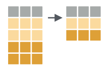
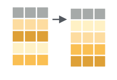
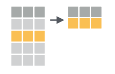

<style type="text/css">

body, td {
   font-size: 16px;
}
code.r{
  font-size: 12px;
}
pre {
  font-size: 12px
}

</style>

```{r klippy, echo=FALSE, include=TRUE}
klippy::klippy(lang = c("r", "markdown", "bash"), position = c("top", "right"))
```

```{r, 'chunk_options', include=FALSE}
source("../bin/chunk-options.R")
knitr_fig_path("02-")
```

# Objectives

- Learn essential data manipulation functions of `dplyr`:
    - `select()` columns
    - `filter()` rows
    - `arrange()` rows
    - `mutate()` columns
    - `group_by()` rows
- Learn about the pipe operator (`%>%`) and how to use it to chain together multiple functions.

# Loading data

In the previous lesson we used the `read_csv()` function to load the `gm97` data. Let's do that again:

```{r, 'load_gm97_display', eval = FALSE}
library(tidyverse)
gm97 = read_csv('data/gapminder_1997.csv')
```

```{r, 'load_gm97', echo = FALSE}
library(tidyverse)
gm97 = read_csv('../data/gapminder_1997.csv')
```

This time, let's look more closely at the data. If we type the name of the object and evaluate it, we'll see a preview:

```{r, 'preview_data'}
gm97
```

**Checkpoint**

The output shows we have "a tibble" and its dimensions are 142 rows by 6 columns. We then see:

- Column headings (country, year, etc)
- Column data types (chr, dbl, etc)
- The entries of the first 10 rows.

Data in the form of a table is very common in R. The "base R" type is called a `data.frame`. The `tidyverse` extends on this notion with a `tibble`. The commands we'll learn in this lesson work on `data.frame`s and `tibble`s. We'll use `data.frame`, `tibble`, and "data table" interchangeably throughout the lessons.

# Exploring data tables

After reading in data, it's a good habit to preview it, look at summaries of it, and, in so doing, look for issues. When data contains hundreds of rows, it's a good idea to get a sense for the values and ranges of the data.

## Get stats with `summary()`

The `summary()` function, from base R, takes a data table as input and will summarize the columns automatically depending on their data type.

```{r, 'summary'}
summary(gm97)
```

We see that for the numeric data we get quantile information and the mean, whereas for character data we simply get the length of the column. For data with NAs, the number thereof would be displayed.

## Get stats with `summarize()`

If we wanted to know the mean life expectancy in the dataset, we could use the the `dplyr` `summarize()` function, specifying that we want the `mean()`:

```{r, 'summarize_lifeexp'}
summarize(gm97, avgLifeExp = mean(lifeExp))
```

We can use any column name as the input to `mean()`, so long as it's a numeric, and we get a new tibble with our value returned as a column, named as specified. Note, this matches the result of `summary()` with some difference in the number of significant digits displayed. Alternatively, we could have simply applied `mean()` directly to the column `lifeExp`:

```{r, 'mean_lifexp_dollar'}
mean(gm97$lifeExp)
```

This is the base R way, with the `$` being how columns of a data table are accessed. The `mean()` function returns a number, whereas `summarize()` returns a `tibble`. In the `tidyverse`, a function whose input is a `tibble` will also have a `tibble` as output. 

**Checkpoint**

> ## Tip: Reference columns by name
> 
> While it is possible to access columns by their numerical index, this is less prefereable than using the explicit name of the column because altering the table could change the column indices. Depending on the situation, we might not even get an error, and instead would be simply operating on the wrong column. A dangerous situation to be in.

## Find unique values with `distinct()`



Data is often subject to errors. To quickly catch data entry problems, the `distinct()` function can be used to show all unique values in the column of a table. Let's take a look at the distinct values of the continents column:

```{r, 'distinct_continent'}
distinct(gm97, continent)
```

Here we get a `tibble` back with the unique continent names in their order of appearance. There is an equivalent base R way to do this with the `unique()` function:

```{r, 'unique_continent'}
unique(gm97$continent)
```

Either way, if there was a misspelled entry, for example, "Urope" we would have immediately seen it.

**Checkpoint**

## Sorting data with `arrange()`



We have a rich dataset whose default ordering is by country. But it's natural to ask questions like "What country has the highest life expectancy?" or "What country had the highest GDP per capita?" The `arrange()` function can help us quickly find the answers.

```{r, 'arrange_lifeexp'}
arrange(gm97, lifeExp)
```

This seems to have done an ascending order on `lifeExp` by default. We have some options, one of which is to wrap the column of interest in the `desc()` function to indicate we want the order to be descending.

```{r, 'arrange_lifeexp_desc'}
arrange(gm97, desc(lifeExp))
```

And here we see that Japan is the country with the longest lived citizens at a little over 80 years.

**Checkpoint**

> ## Exercise
> Which country has the highest GDP per capita in 1997?
> 
> ```{r, 'highest_gdppercap_solution'}
> arrange(gm97, desc(gdpPercap))
> ```
> 

## Subset columns with `select()`


Sometimes data tables have many columns, and it can be useful to select only a few of them to export, use downstream, preview, etc. The `select()` function works on columns:

```{r, 'select_positive'}
select(gm97, country, year, lifeExp)
```

We can do the equivalent of `select()` statement using base R with:

```{r, 'base_select_positive'}
gm97[ , c('country', 'year', 'lifeExp')]
```

Here we use the square-bracket notation again, leaving the row position blank returns all rows, and in the column position we specify the names of the columns as a vector with the `c()` function, meaning "combine", creates a temporary vector of column names. Note that we quoted the column names in this code, whereas in `select()` we didn't have to.

**Checkpoint**

Columns can be removed using `select()` with a "minus" in front of the column name.

```{r, 'select_negative'}
select(gm97, -year)
```

Notice the `year` column is no longer displayed.

## Saving objects

If we view `gm97` we notice haven't changed the original data because we haven't saved the object.

```{r, 'df_persists'}
gm97
```

To manipulate `gm97` and save it as a new object we have to assign it a new object name:

```{r, 'new_df'}
gm97_subset = select(gm97, country, year, lifeExp)
gm97_subset
```

## Saving objects to file

The original data file we read in `data/gapminder_1997.csv` remains the same throughout all these manipulations. What happens in R stays in R until we explicitly write a new object to the same file. **It's good practice to keep raw input data separate, and to never overwrite it.** Let's use the `write_csv()` function to write the `gm97_subset` data to a file. First let's look at `?write_csv` and determine what are the required parameters.

It looks like `x`, the data to be written and `file`, the path to the output file are required. There are other options, but we won't use them here.

```{r, 'write_csv', eval = FALSE}
write_csv(gm97_subset, file = 'gm97_subset.csv')
```

**Checkpoint**

## Narrow down rows with `filter()`


We have seen that `select()` subsets the columns of a table. The function `filter()` subsets the rows of a data table based on logical criteria. So first, a note about logical operators in R:

| Operator | Description              | Example      |
|----------|--------------------------|--------------|
| <        | less than                | `pop < 575990` |
| <=       | less than or equal to    | `pop <= 575990` |
| >        | greater than             | `pop > 1000000` |
| >=       | greater than or equal to | `pop >= 38000000` |
| ==       | exactly equal to         | `continent == 'Africa'` |
| !=       | not equal to             | `continent != 'Asia'` |
| !x       | not x                    | `!(continent == 'Africa')` |
| a \| b   | a or b                   | `pop < 575990 | pop > 1000000` |
| a & b    | a and b                  | `continent == 'Asia' & continent == 'Africa'` |
| a %in% b | a in b                   | `continent %in% c('Asia', 'Africa')` |

With these operators in mind we can filter the `gm97` data table in a variety of ways. To filter for only the African data we could:

```{r, 'filter_by_continent'}
filter(gm97, continent == 'Africa')
```

The base R equivalent of the above uses the square bracket notation that we saw earlier with a twist:

```{r, 'base_filter_by_continent'}
gm97[gm97$continent == 'Africa', ]
```

Here we put the condition in the row position, before the comma, because we want to subset rows. The blank after the comma indicates we want all the columns returned.

> ## Exercise
> How can we filter the data for just the United Kingdom?
> 
> ```{r, 'filter_solution'}
> filter(gm97, country == 'United Kingdom')
> ```
> 

We can answer the question, "Which African countries have population over 10,000,000?" by using the `&` operator with our previous code. This requires both conditions to be true at the same time:

```{r, 'filter_by_continent_population'}
filter(gm97, continent == 'Africa' & pop >= 10000000)
```

We can subset the data for very large or very small population with the `|` operator, which requires either condition to be true:

```{r, 'filter_by_large_and_small_pop'}
filter(gm97, pop <= 1000000 | pop >= 1000000000)
```

This gives us all the countries with fewer than a million people **or** more than a billion people.

**Checkpoint**

## Make new columns with `mutate()`


It's common to use existing columns of a data table to create new columns. For example, in the `gm97` data we have a `pop` column and a `gdpPercap` column. We could multiply these two columns to get a new `gdp` column. The `dplyr` function `mutate()` adds columns to an existing data table.

```{r, 'mutate_gdp'}
mutate(gm97, gdp = pop * gdpPercap)
```

As before, this didn't actually add the column to `gm97`, we have to save the object to store it:

```{r, 'mutate_gdp_saved'}
gm97_gdp = mutate(gm97, gdp = pop * gdpPercap)
gm97_gdp
```

**Checkpoint**

## Combine functions with the `%>%` pipe

We've learned how to subset rows with `filter()`, select columns with `select()`, get distinct elements with `distinct()`, and summarize columns with `summarize()`. It's common to use these functions in sequence, where the output of one becomes the input of the next. The concept of "pipe" (`|`) from `bash` has an equivalent in the `tidyverse` in the `%>%` symbol. To see this in action, let's select data from Oceania and display only the `country`, `continent`, and `pop` columns.

```{r, 'pipe_example1'}
gm97 %>% filter(continent == 'Oceania') %>% select(country, continent, pop)
```

> ## Question
> 
> Does the order of `filter()` and `select()` matter? Would something like the following work, why or why not?
> 
> ```{r, 'pipe_order', eval = FALSE}
> gm97 %>% 
>     select(country, pop) %>% 
>     filter(continent == 'Oceania')
> ```
> 

It seems there are only two countries, Australia and New Zealand. If we wanted to take the mean of the populations we could pipe the data, after filtering, to `summarize()` as in:

```{r, 'pipe_example2'}
gm97 %>%
    filter(continent == 'Oceania') %>%
    summarize(oceania_mean_pop = mean(pop))
```

Note this is distinct from taking the mean over the entire dataset:

```{r, 'pipe_example3'}
gm97 %>% summarize(global_mean_pop = mean(pop))
```

Here we've meaningfully named our output, but that was optional. For quick data exploration that could be left off.

**Checkpoint**

## Group rows with `group_by()`


If we wanted to determine the mean populations over all the continents, we could run the above code we used for Oceania, but replace Oceania with each continent name. That's a bit tedious, and the `tidyverse` provides a very nice function, `group_by()`, that breaks a data table up into groups and will perform operations within the groups.

```{r, 'group_by_means'}
gm97 %>% 
    group_by(continent) %>% 
    summarize(mean_pop = mean(pop))
```

Notice that the Oceania average matches what we got above. Going back to our Oceania subset, we can use `group_by()` with the counting function `n()` to count how many countries there are per continent in the `gm97` data, and verify that there really only are two:

```{r, 'group_by_count'}
gm97 %>% 
    group_by(continent) %>% 
    summarize(num_countries_per_continent = n())
```

There is a base R function, `table()`, that tabulates the number of time an entry occurs in a vector, and is useful for quick sanity checking:

```{r, 'count_with_table'}
table(gm97$continent)
```

**Checkpoint**

> ## Exercise
> 
> In summarizing data, it's often useful to build a nicely formatted table with min, median, and max values of a variable. Below is an example of code to do that for the populations by continent, and arranged by the median population.
> 
> ```{r, 'dplyr_exercise_example'}
> gm97 %>% 
>     group_by(continent) %>%
>     summarize(
>         min_POP = min(pop),
>         median_POP = median(pop),
>         max_POP = max(pop)
>     ) %>% 
>     arrange(median_POP)
> ```
> Try to write the code that would generate the following table, similar to the above, but for the GDP per continent instead of the population, including the mean GDP in addition to the min, median, and max, as well as ordering the results by mean GDP.
> 
> ```{r, 'dplyr_exercise_hidden', echo = FALSE}
> gm97 %>% 
>     mutate(gdp = pop * gdpPercap) %>%
>     group_by(continent) %>%
>     summarize(
>         min_GDP = min(gdp),
>         mean_GDP = mean(gdp),
>         median_GDP = median(gdp),
>         max_GDP = max(gdp)
>     ) %>% 
>     arrange(mean_GDP)
> ```
> 


<br/>
<br/>
<hr/>
| [Previous lesson](r-01-introduction.html) | [Top of this lesson](#top) | [Next lesson](r-04-bioconductor.html) |
| :--- | :----: | ---: |