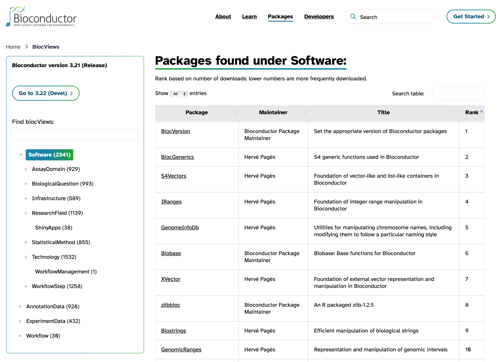

<style type="text/css">

body, td {
   font-size: 16px;
}
code.r{
  font-size: 12px;
}
pre {
  font-size: 12px
}

</style>

```{r klippy, echo=FALSE, include=TRUE}
klippy::klippy(lang = c("r", "markdown", "bash"), position = c("top", "right"))
```

```{r, 'chunk_options', include=FALSE}
source("../bin/chunk-options.R")
knitr_fig_path("04-")
```

<!-- example of rendered lesson https://datacarpentry.org/genomics-r-intro/02-r-basics/index.html -->

# Objectives

- Understand what an R package is.
- Learn about the different package repositories, and their specialities.
- Learn how to install packages from the different repositories.

# What is a package?

A **package** is the collection of functions (and sometimes data) stored as files in a particular structure. A **library** is the directory location where the code and data are stored. Typically the words are used interchangeably.

R comes with a number of packages already installed, but it's in the ability to use additional packages that makes R especially useful. There are three main places to look for R packages. These include:

1. [CRAN (the Comprehensive R Archive Network)](https://cran.r-project.org/), for general purpose packages. Packages in this repository are subject to documentation and testing requirements that give confidence that the code works as advertised.
2. [Bioconductor](https://bioconductor.org/), for Bioinformatics packages. Packages in this repository are subject to even more stringent documentation and testing requirements. They are meant to facilitate "rigorous and reproducible analysis of data from current and emerging biological assays."
3. Individual repositories on GitHub, often for development versions of packages already on (or soon to be on) CRAN or Bioconductor. Packages here are subject to caveat emptor, that is, "let the buyer beware."

To summarize:

| Repository | Purpose | Documentation | Testing |
| :--- | :--- | :--- | :--- |
| CRAN | General purpose packages | Required | Required |
| Bioconductor | Bioinformatics packages | Required | Required |
| GitHub | General purpose packages | Not required | Not required |

## Is `tidyverse` a package?

The `tidyverse` is actually a collection of packages that are designed to work together. The `tidyverse` is then a meta-package, with constituent packages like `dplyr`, `ggplot2`, `tidyr`, and others. When you install the `tidyverse` package, it will automatically install all of the constituent packages for you.

# Installing packages

Historically, the package install method was peculiar to the housing repository. Now, the `BiocManager` package from Bioconductor makes it possible to install packages from essentially any source.

## One installer to rule them all

The `BiocManager::install()` function can install CRAN, Bioconductor, and GitHub packages. Here's an example with a mix of all three:

```{r eval = FALSE}
# DO NOT RUN
# tidyverse is on CRAN, DESeq2 is on Bioconductor, and methylSig is on GitHub
BiocManager::install(c('tidyverse', 'DESeq2', 'sartorlab/methylSig'))
```

<details>
  <summary>Expand for repository-specific installers</summary>
<h3>From CRAN</h3>

To install a package from CRAN, you can run something like:

```{r eval = FALSE}
# Do not run, this is already installed for us
install.packages('tidyverse')
```

<h3>From Bioconductor</h3>

To install a package from Bioconductor, you first need the `BiocManager` package. Then you can give the name of the package to the installer, as in:

```{r eval = FALSE}
# Do not run
install.packages('BiocManager')

# The :: notation before the install() tells R to use the function from BiocManager
BiocManager::install('DESeq2')
```

<h3>From GitHub</h3>

To install packages from GitHub one can use the `remotes::install_github()` function. For example:

```{r eval = FALSE}
# Do not run
# To install the package at https://github.com/sartorlab/methylSig/
# The format is <repository_owner>/<repository_name>
remotes::install_github('sartorlab/methylSig')
```
</details>
<br>

# Search for Bioconductor packages

While this workshop series focuses on differential expression analysis of RNA-seq data, there are many different types of data and analyses that bioinformaticians may want to work with. Sometimes you may get a new dataset and not know exactly where to start with analyzing or visualizing it. The Bioconductor package search view can be a great way to browse through the packages that are available.

There are several thousand packages available through the Bioconductor website. It can be a bit of a challenge to find what you want, but one helpful resource is the [package search page](https://bioconductor.org/packages/release/BiocViews.html#___Software) (pictured below).



# Using packages

Once you have installed a package, that doesn't mean you have access to all its functions in the R session. You have to use the `library()` command to load a package, like with:

```{r eval = FALSE}
library(DESeq2)
```

Note that when installing a package we quoted the package name, but when we load the library after installation we don't.

# Resources

- [Bioconductor](https://bioconductor.org/)
- [Bioconductor package search](https://bioconductor.org/packages/release/BiocViews.html#___Software)
- [CRAN](https://cran.r-project.org/)

# Objectives

- Understand what an R package is.
- Learn about the different package repositories, and their specialities.
- Learn how to install packages from the different repositories.

<br/>
<br/>
<hr/>
| [Previous lesson](r-02-exploration-dplyr.html) | [Top of this lesson](#top) | [Next lesson](r-05-help.html) |
| :--- | :----: | ---: |