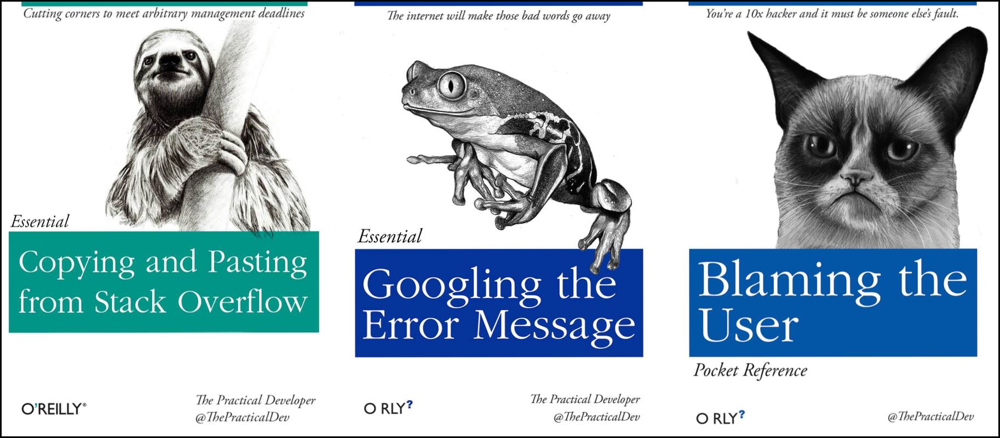

<style type="text/css">

body, td {
   font-size: 16px;
}
code.r{
  font-size: 12px;
}
pre {
  font-size: 12px
}

</style>

```{r klippy, echo=FALSE, include=TRUE}
klippy::klippy(lang = c("r", "markdown", "bash"), position = c("top", "right"))
```

```{r, 'chunk_options', include=FALSE}
source("../bin/chunk-options.R")
knitr_fig_path("05-")
```

# Objectives

- Learn where to get help with R.
- Learn how to ask for help with R.

# With a little help from my friends



No matter how much experience you have with R, you will find yourself needing help. There is no shame in researching how to do something in R, and most people will find themselves looking up how to do the same things that they "should know how to do" over and over again. Here are some tips to make this process as helpful and efficient as possible.

> "Never memorize something that you can look up"
> -- A. Einstein

# Finding help

There are a few websites that are useful for getting help with R. They can be summarized as follows:

| Website | Purpose |
| :--- | :--- |
| [R Documentation](https://www.rdocumentation.org/) | Searchable documentation for R packages on CRAN and Bioconductor |
| [Bioconductor Support](https://support.bioconductor.org/) | Support forum for Bioconductor packages |
| [stackoverflow](https://stackoverflow.com/questions/tagged/r) | General programming questions |
| [Biostars](https://www.biostars.org/) | Bioinformatics specific questions |

# Getting help

If you are trying to get help on a forum, it best to follow some basic guidelines to make sure you get the help you need.

- **Check if a question has already been asked.** Forum members can get touchy if duplicate questions are asked.
- **Clearly describe your problem in words.** State what you're trying to do, what you tried, and the result, including the full text of the error message.
- **Try to include a "minimally reproducible example."** This means providing data and code that anyone can run to reproduce the error, and diagnose the issue. Specifically, this means you can't share large datasets, or idiosyncratic code. 

The [How to ask for R help](http://blog.revolutionanalytics.com/2014/01/how-to-ask-for-r-help.html) blog post has some good examples of how to ask for help with R. Note that this advice largely generalizes to other programming languages.

## Sharing your session info

Part of getting help, especially with R, is including your `sessionInfo()` with your question. This helps people know what packages and what versions you have installed. This will help reproduce the issue and possibly find a solution.

There are a couple ways to get the session information. The first is:

```
> sessionInfo()
R version 4.5.0 (2025-04-11)
Platform: x86_64-pc-linux-gnu
Running under: Ubuntu 22.04.5 LTS

Matrix products: default
BLAS:   /usr/lib/x86_64-linux-gnu/blas/libblas.so.3.10.0 
LAPACK: /usr/lib/x86_64-linux-gnu/lapack/liblapack.so.3.10.0  LAPACK version 3.10.0

locale:
 [1] LC_CTYPE=C.UTF-8       LC_NUMERIC=C           LC_TIME=C.UTF-8       
 [4] LC_COLLATE=C.UTF-8     LC_MONETARY=C.UTF-8    LC_MESSAGES=C.UTF-8   
 [7] LC_PAPER=C.UTF-8       LC_NAME=C              LC_ADDRESS=C          
[10] LC_TELEPHONE=C         LC_MEASUREMENT=C.UTF-8 LC_IDENTIFICATION=C   

time zone: America/Detroit
tzcode source: system (glibc)

attached base packages:
[1] stats     graphics  grDevices utils     datasets  methods   base     

other attached packages:
 [1] lubridate_1.9.4 forcats_1.0.0   stringr_1.5.1   dplyr_1.1.4     purrr_1.0.4    
 [6] readr_2.1.5     tidyr_1.3.1     tibble_3.2.1    ggplot2_3.5.2   tidyverse_2.0.0

loaded via a namespace (and not attached):
 [1] vctrs_0.6.5        cli_3.6.5          rlang_1.1.6        stringi_1.8.7     
 [5] generics_0.1.4     glue_1.8.0         hms_1.1.3          scales_1.4.0      
 [9] grid_4.5.0         tzdb_0.5.0         lifecycle_1.0.4    compiler_4.5.0    
[13] RColorBrewer_1.1-3 timechange_0.3.0   pkgconfig_2.0.3    rstudioapi_0.17.1 
[17] farver_2.1.2       R6_2.6.1           tidyselect_1.2.1   pillar_1.10.2     
[21] magrittr_2.0.3     tools_4.5.0        withr_3.0.2        gtable_0.3.6

```

This command will work in any R environment. For a slightly more convenient output, use `devtools::session_info()`. Note, you'll have to have the `devtools` package installed.

```
> devtools::session_info()
─ Session info ──────────────────────────────────────────────────────────────────────────
 setting  value
 version  R version 4.5.0 (2025-04-11)
 os       Ubuntu 22.04.5 LTS
 system   x86_64, linux-gnu
 ui       RStudio
 language (EN)
 collate  C.UTF-8
 ctype    C.UTF-8
 tz       America/Detroit
 date     2025-06-11
 rstudio  2024.12.1+563 Kousa Dogwood (server)
 pandoc   2.9.2.1 @ /usr/bin/pandoc
 quarto   1.5.57 @ /usr/lib/rstudio-server/bin/quarto/bin/quarto

─ Packages ──────────────────────────────────────────────────────────────────────────────
 package      * version date (UTC) lib source
 cachem         1.1.0   2024-05-16 [2] CRAN (R 4.5.0)
 cli            3.6.5   2025-04-23 [2] CRAN (R 4.5.0)
 devtools       2.4.5   2022-10-11 [2] CRAN (R 4.5.0)
 digest         0.6.37  2024-08-19 [2] CRAN (R 4.5.0)
 dplyr        * 1.1.4   2023-11-17 [2] CRAN (R 4.5.0)
 ellipsis       0.3.2   2021-04-29 [2] CRAN (R 4.5.0)
 farver         2.1.2   2024-05-13 [2] CRAN (R 4.5.0)
 fastmap        1.2.0   2024-05-15 [2] CRAN (R 4.5.0)
 forcats      * 1.0.0   2023-01-29 [2] CRAN (R 4.5.0)
 fs             1.6.6   2025-04-12 [2] CRAN (R 4.5.0)
 generics       0.1.4   2025-05-09 [2] CRAN (R 4.5.0)
 ggplot2      * 3.5.2   2025-04-09 [2] CRAN (R 4.5.0)
 ggrepel      * 0.9.6   2024-09-07 [2] CRAN (R 4.5.0)
 glue           1.8.0   2024-09-30 [2] CRAN (R 4.5.0)
 gtable         0.3.6   2024-10-25 [2] CRAN (R 4.5.0)
 hms            1.1.3   2023-03-21 [2] CRAN (R 4.5.0)
 htmltools      0.5.8.1 2024-04-04 [2] CRAN (R 4.5.0)
 htmlwidgets    1.6.4   2023-12-06 [2] CRAN (R 4.5.0)
 httpuv         1.6.16  2025-04-16 [2] CRAN (R 4.5.0)
 later          1.4.2   2025-04-08 [2] CRAN (R 4.5.0)
 lifecycle      1.0.4   2023-11-07 [2] CRAN (R 4.5.0)
 lubridate    * 1.9.4   2024-12-08 [2] CRAN (R 4.5.0)
 magrittr       2.0.3   2022-03-30 [2] CRAN (R 4.5.0)
 memoise        2.0.1   2021-11-26 [2] CRAN (R 4.5.0)
 mime           0.13    2025-03-17 [2] CRAN (R 4.5.0)
 miniUI         0.1.2   2025-04-17 [2] CRAN (R 4.5.0)
 pillar         1.10.2  2025-04-05 [2] CRAN (R 4.5.0)
 pkgbuild       1.4.8   2025-05-26 [2] CRAN (R 4.5.0)
 pkgconfig      2.0.3   2019-09-22 [2] CRAN (R 4.5.0)
 pkgload        1.4.0   2024-06-28 [2] CRAN (R 4.5.0)
 profvis        0.4.0   2024-09-20 [2] CRAN (R 4.5.0)
 promises       1.3.3   2025-05-29 [2] CRAN (R 4.5.0)
 purrr        * 1.0.4   2025-02-05 [2] CRAN (R 4.5.0)
 R6             2.6.1   2025-02-15 [2] CRAN (R 4.5.0)
 RColorBrewer   1.1-3   2022-04-03 [2] CRAN (R 4.5.0)
 Rcpp           1.0.14  2025-01-12 [2] CRAN (R 4.5.0)
 readr        * 2.1.5   2024-01-10 [2] CRAN (R 4.5.0)
 remotes        2.5.0   2024-03-17 [2] CRAN (R 4.5.0)
 rlang          1.1.6   2025-04-11 [2] CRAN (R 4.5.0)
 rstudioapi     0.17.1  2024-10-22 [2] CRAN (R 4.5.0)
 scales         1.4.0   2025-04-24 [2] CRAN (R 4.5.0)
 sessioninfo    1.2.3   2025-02-05 [2] CRAN (R 4.5.0)
 shiny          1.10.0  2024-12-14 [2] CRAN (R 4.5.0)
 stringi        1.8.7   2025-03-27 [2] CRAN (R 4.5.0)
 stringr      * 1.5.1   2023-11-14 [2] CRAN (R 4.5.0)
 tibble       * 3.2.1   2023-03-20 [2] CRAN (R 4.5.0)
 tidyr        * 1.3.1   2024-01-24 [2] CRAN (R 4.5.0)
 tidyselect     1.2.1   2024-03-11 [2] CRAN (R 4.5.0)
 tidyverse    * 2.0.0   2023-02-22 [2] CRAN (R 4.5.0)
 timechange     0.3.0   2024-01-18 [2] CRAN (R 4.5.0)
 tzdb           0.5.0   2025-03-15 [2] CRAN (R 4.5.0)
 urlchecker     1.0.1   2021-11-30 [2] CRAN (R 4.5.0)
 usethis        3.1.0   2024-11-26 [2] CRAN (R 4.5.0)
 vctrs          0.6.5   2023-12-01 [2] CRAN (R 4.5.0)
 withr          3.0.2   2024-10-28 [2] CRAN (R 4.5.0)
 xtable         1.8-4   2019-04-21 [2] CRAN (R 4.5.0)

 [1] /home/workshop/chrismgates/R/x86_64-pc-linux-gnu-library/4.5
 [2] /efs/workshop/R/library
 [3] /usr/local/lib/R/site-library
 [4] /usr/lib/R/site-library
 [5] /usr/lib/R/library
 * ── Packages attached to the search path.

─────────────────────────────────────────────────────────────────────────────────────────
```

## Sharing your data

Many times, there may be some issues with your data and the way it is formatted. In that case, you may want to share that data with someone else. However, you may not need to share the whole dataset; looking at a subset of your 50,000 row, 10,000 column dataframe may be TMI (too much information)! You can take an object you have in memory such as dataframe (if you don't know what this means yet, we will get to it!) and save it to a file. In our example we will use the `dput()` function on the `iris` dataframe which is an example dataset that is installed in R:


```{r}
# iris is an example data.frame built into R
dput(head(iris)) # iris is an example data.frame that comes with R
```

This output very clearly states the structure of the `iris` data frame. Alternatively, you can also save objects in R memory to a file by specifying the name of the object, in this case the `iris` data frame, and passing a filename to the `file=` argument.

```{r, eval=FALSE}
# By convention, we use the .rds file extension
saveRDS(iris, file="iris.rds")

# To load this type of file back
iris_rds = readRDS("iris.rds")
```

# Final FAQs on R

Finally, here are a few pieces of introductory R knowledge that are too good to pass up. While we won't return to them in this course, we put them here because they come up commonly:

**Do I need to click Run every time I want to run a script?**

- No. In fact, the most common shortcut key allows you to run a command (or any lines of the script that are highlighted):
  - Windows execution shortcut: <KBD>Ctrl</KBD>+<KBD>Enter</KBD>
  - Mac execution shortcut: <KBD>Cmd(⌘)</KBD>+<KBD>Enter</KBD>

  To see a complete list of shortcuts, click on the <KBD>Tools</KBD> menu and select <KBD>Keyboard Shortcuts Help</KBD>

**What's with the brackets in R console output?**
- R returns an index with your result. When your result contains multiple values, the number tells you what ordinal number begins the line, for example:

```{r}
1:101 # generates the sequence of numbers from 1 to 101
```

In the output above, `[81]` indicates that the first value on that line is the 81st item in your result


**Can I run my R script without RStudio?**

- Yes, remember - RStudio is running R. You get to use lots of the enhancements RStudio provides, but R works independent of RStudio. See [these tips](https://support.rstudio.com/hc/en-us/articles/218012917-How-to-run-R-scripts-from-the-command-line) for running your commands at the command line


**Where else can I learn about RStudio?**
- Check out the <KBD>Help</KBD> menu, especially "Cheatsheets" section

<br/>
<br/>
<hr/>
| [Previous lesson](r-04-bioconductor.html) | [Top of this lesson](#top) | [Next lesson](r-03-exploration-ggplot.html) |
| :--- | :----: | ---: |