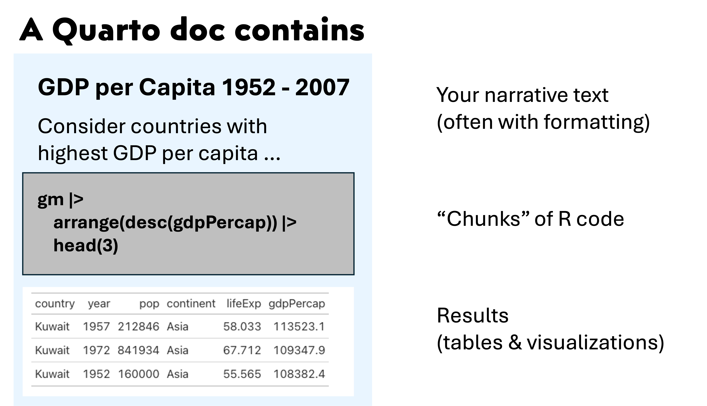
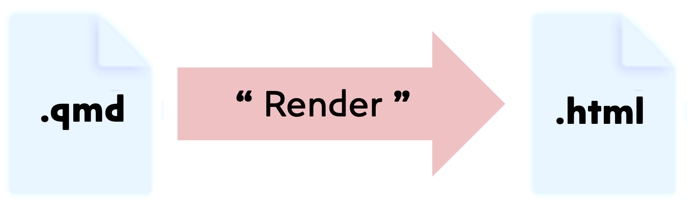
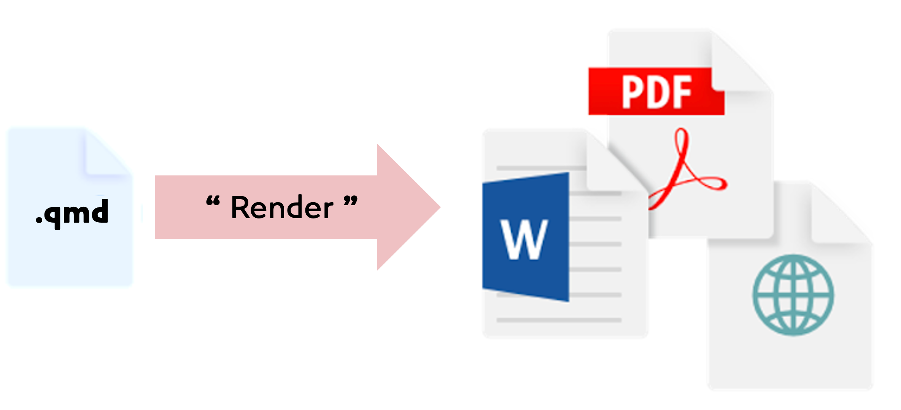

```{=html}
<style type="text/css">

body, td {
   font-size: 16px;
}
code.r{
  font-size: 12px;
}
pre {
  font-size: 12px
}

</style>
```

```{r, include = FALSE}
source("../bin/set_values.R")
```

```{r klippy, echo=FALSE, include=TRUE}
klippy::klippy(lang = c("r", "markdown", "bash"), position = c("top", "right"))
```

```{r, 'chunk_options', include=FALSE}
source("../bin/chunk-options.R")
knitr_fig_path("06-")
```

# Objectives

-   Learn the purpose of Quarto
-   Understand structure of a Quarto doc
-   Understand code chunks
-   Render a Quarto doc into an html file

# Why Quarto?

Collecting commands into a script is the first (and arguably most important) step toward reproducible computing.

[Literate
Programming](https://en.wikipedia.org/wiki/Literate_programming){target="_blank"}
is a related technique that combines a script's computational steps with 
explanations and computational results. 

R implements this pattern through **Quarto** (nee RMarkdown). Quarto combines

 - explanatory text (why)
 - computation (how)
 - results & visualizations (what)

Keeping these pieces in a **single document** that 
can be interpreted by both computers and humans helps keep the why/how/what 
clear, consistent, and accurate.

# Quarto document structure and usage

- A Quarto doc is a single text file that contains 
  - your text (often with formatting)
  - **code chunks**
  - results & plots
  
  
  
- A Quarto doc can be opened in a text editor, but uses a **markdown syntax** to enable formatting. The Quarto doc is sometimes generically referred to as a **markdown doc**.
- You can add text, formatting, and code chunks by typing in the source pane or inserting elements in the visual pane. (And You can toggle back and forth.)
- **Rendering** a Quarto document applies the text formatting, executes all the code chunks, and inserts the code results to create a new output file.
 
- You can rerun a single code chunk to refresh just those results.
- Code chunk options let you adjust how code chunk output is displayed.
- Code chunks can generate any results you can build in a script or in the R console, 
  including tables or plots.
- R libraries (like `gt`) can enhance how output is rendered.
- Quarto can convert a single quarto doc into many different document formats.
 
- FYI, Quarto can interpret Python code chunks. (Along with a few other languages.)
- You can share the html or PDF files with collaborators. Keep the Quarto file 
safe (as you would a script) because that's the file you will need if you ever 
need to adjust or run again. 

---

# Exercises

1. Make a Quarto doc.

  - In the file pane, create a new directory called `content`.
  - Using the RStudio menu, generate a new Quarto document. 
  - Save this document in the `content` dir with the name `gdp_per_capita.qmd`

2. Add this text block near the top of the Quarto doc.

```{verbatim}
# Consider GDP per capita

The **code chunks** below will show how to output 
  - tables
  - plots
```

3. Extend the Quarto doc to include this code chunk:
````{verbatim}
```{r}
#| tbl-cap: "A data frame."
library(tidyverse)
gm = read_csv('data/gapminder_data.csv')
gm |> 
  filter(year == 1952) |> 
  arrange(desc(gdpPercap)) |>
  head(3)
```
````

4.  Consider the dplyr code above; what is it doing? Could you explain what that code is doing to a colleague who wasn't in this workshop?
Try improving the table caption above and re-run that code chunk.

5. Create another code chunk that uses the gt package to improve the table aesthetics.
````{verbatim}
```{r}
library(gt)
gm |> 
  filter(year == 1952) |> 
  arrange(desc(gdpPercap)) |>
  head(3) |>
  gt()
```
````

6. Add this ggplot function as a code chunk.
````{verbatim}
```{r}
#| fig-cap: "A plot"
gm |> ggplot(aes(x = year, y = gdpPercap, color = continent, group = country)) +
  geom_line() + 
  facet_grid(cols = vars(continent)) +
  labs(
       title = 'GDP per Capita 1952 - 2007',
       x = 'Year', y = 'GDP per Capita') +
  theme_bw() + 
  theme(axis.text.x = element_text(angle = 90, vjust = 0.5, hjust = 1))
```
````

7.  Consider the ggplot code above; what is it doing? 
Try improving the figure caption above a re-running that code chunk.

8. Render into a new html file. Note the new html file in the file pane along with a new folder of html supporting docs.

9. Quarto metadata (at the top) controls how the whole document is rendered
   
````{verbatim}
---
title: "Untitled"
format: html
editor: visual
---
````

Adjust the title from "Untitled" to "Consider GDP per capita" and re-render the 
document.

10. To make a self-contained html file (that has all the images and supporting 
   docs embedded inside it), adjust the Quarto metadata to insert 
   the line `embed-resources: true` as shown below. (Indenting matters)
````{verbatim}
---
title: "Consider GDP per capita"
format:
  html:
    embed-resources: true
editor: visual
---
````

Re-render the document and note the html file is slightly larger. A self-contained 
html file is easy to shared (e.g. email) with a colleague.

---

# Summary

- Quarto improves reproducibility by collecting text, code, and results into a single doc.
- Quarto docs use markdown syntax to format text. 
- You can edit the doc with in `Visual` tab or by directly typing markdown in the `Source` view.
- Quarto docs contain executable **code chunks** that produce tables and plots.
  - Code chunks can be labeled
  - Code chunks can be adjusted to display differently 
- You **Render** a Quarto doc to:
  - apply the markdown formatting
  - execute the code chunks to build results and plots
  - combine the above into a new file (HTML or PDF or other type).


# References & more info
- [Quarto homepage](https://quarto.org/){target="_blank"}
- [Quarto cheatsheet](https://rstudio.github.io/cheatsheets/quarto.pdf){target="_blank"}
- [More info on markdown syntax](https://quarto.org/docs/authoring/markdown-basics.html){target="_blank"}
- [A self-paced guided tour of Quarto](https://quarto.org/docs/get-started/hello/rstudio.html){target="_blank"}
- [A concise Youtube intro to Quarto](https://www.youtube.com/watch?v=_f3latmOhew){target="_blank"}


<br/>


| [Previous lesson](r-03-exploration-ggplot.html) | [Top of this lesson](#top) | [Next lesson](workshop-wrap-up.html) |
|:--------------------|:-----------------------------:|--------------------:|
