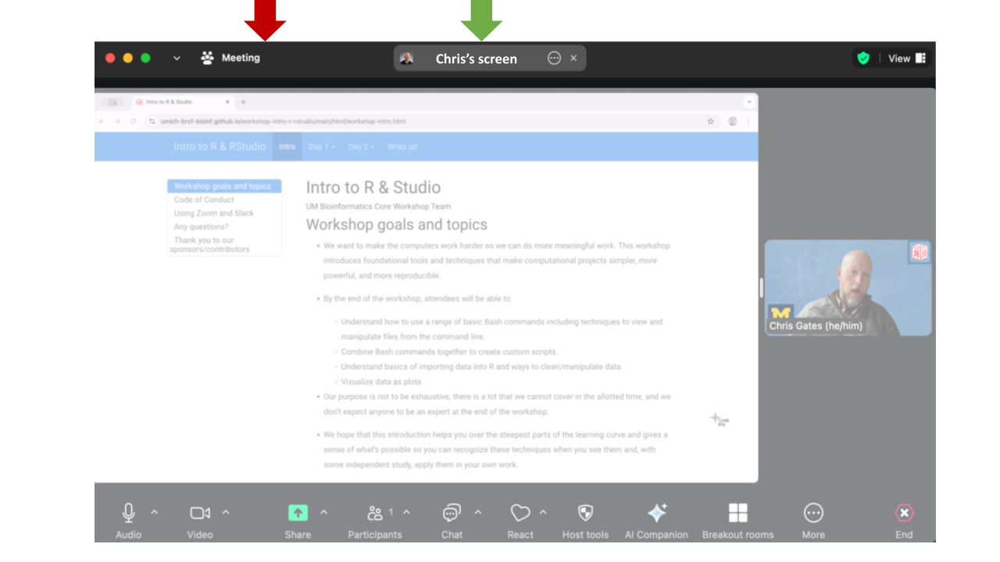

<style type="text/css">

body, td {
   font-size: 18px;
}
code.r{
  font-size: 12px;
}
pre {
  font-size: 12px
}

a[target="_blank"]::after {
    background: url(images/external-link.png) center right no-repeat;
    padding-right: 13px;
}
</style>

```{r, include = FALSE}
source("../bin/set_values.R")
```

# Workshop goals and topics

 - We want to make the computers work harder so we can do more meaningful work. This workshop introduces foundational tools and techniques that make computational projects simpler, more powerful, and more reproducible.

 - By the end of the workshop, attendees will be able to
   - Use RStudio to build R scripts, examine R data structures, navigate directories and files
   - Understand basics of importing data into R and ways to clean/manipulate data
   - Visualize data as plots

 - Our purpose is not to be exhaustive, there is a lot that we cannot cover in
   the allotted time, and we don't expect anyone to be an expert at the end of
   the workshop. 

- We hope that this introduction helps you over the steepest parts of the learning curve and gives a sense of what’s possible so you can 
recognize these techniques when you see them and, with some independent study, apply them in your own work.

 - Please let us know if there is anything we can do to improve the workshop experience.


```{r, child='helper-gallery.Rmd'}
```

<br/>


# Code of Conduct

- Be kind to others. Do not insult or put down others. Behave professionally. Remember that
  harassment and sexist, racist, or exclusionary jokes are not appropriate for the workshop.

- All communication should be appropriate for a professional audience including people of many
  different backgrounds. Sexual language and imagery is not appropriate.

- The Bioinformatics Core is dedicated to providing a harassment-free community for everyone,
  regardless of gender, sexual orientation, gender identity and expression, disability, physical
  appearance, body size, race, or religion. We do not tolerate harassment of participants in any
  form.

- Thank you for helping make this a welcoming, friendly community for all.

- If you have questions about the CoC please reach out to the hosts during the workshop, or
  email us at bioinformatics-workshops@umich.edu.

- To report a CoC incident/concern, please email Chris Gates (Bioinformatics Core, Managing
  Director) at cgates@umich.edu or contact the `r workshop_vars$coc_contact` at `r workshop_vars$coc_contact_email`.

<br/>
<br/>

# Using Zoom and Slack

## 

- We will be recording this session. Recordings will be available to participants
  following the workshop.

- To see what the instructor is sharing, click the "Chris's Screen" button in the top of the Zoom window. 


- Zoom controls are at the bottom of the Zoom window:


- To minimize distractions, we encourage participants to keep their audio muted
  (unless actively asking a question).
- To maximize engagement, we encourage participants to keep their video on.
- Slack works better than Zoom's Chat function so avoid Zoom Chat for now.
- You can enable transcription subtitles for your view.
- We will be using Breakout Rooms occasionally for ad-hoc 1-1 helper support.
  We will review this in detail together in a few minutes.
- Zoom's "Reactions" are a useful way to interact. You can access these from 
  the **React** button.


  - **Raise Hand** to request clarification or ask a question. (Same as an 
    in-person workshop.)
  - Instructors will use **Green check** and **Red X** to poll the group
    at checkpoints along the way.
<br/>
<br/>

### Exercise: Use Zoom non-verbals
  - Everyone use Zoom to raise your hand. 
<br/>
<br/>


### Exercise: Using Zoom Breakout Rooms
Take a moment to briefly introduce yourself (name, dept/lab, area of study) in a
breakout room.

  - Zoom: Click Breakout Rooms
  - Find the room corresponding to the first letter of your first name
  - Click **Join** (to the right of the room name).
  - When you have completed introductions, you can leave the breakout room to rejoin the main room.


<br/>
<br/>


## 

- **Slack** can be used to communicate to the group or to individuals and has a
  few features/behaviors that we prefer over Zoom's Chat functionality.


  - Slack messages will be posted to the **`r workshop_vars$slack_channel`** channel.
    Click on the channel in the left pane (1) to select this channel.
  - You can type in the **message field** (2); click **send** (3) to
    post your message to everyone.
  - Helpers will respond in a Slack thread (or pose the question to the instructor)
  - You can respond in a message thread by hovering over a message to trigger
    the message menu and clicking the **speech bubble** (4).


### Exercise: Responding in Slack thread
What is one thing you hope to learn in this workshop?
<br/>
<br/>


## Review of Key communication patterns
| |  |  |
|-|:-:|-|
| "I have an urgent question" |  | **Post a question** |
| "I have a general question" | | **Post a question** |
| "I'm stuck / I need a hand" | | **Post a note** |
| Instructor check-in |  -or-  | |
| Instructor Slack question | | **Respond in Slack thread** |
<br/>
<br/>

### Exercise: Group checkpoint
  - Using Zoom, give me a **green-check** if you feel like you understand
    communication patterns or **red-X** if you need clarification.
<br/>
<br/>

## Arranging your screens
It is important that you can see:

 - Zoom (instructor's shared screen + reactions)
 - R/Studio window
 - Slack
 - Lesson plan web page


<br/>
<br/>


# Any questions?
 -
 -


---
# Thank you to our sponsors/contributors


## [University of Michigan Library](https://www.lib.umich.edu/research-and-scholarship){target="_blank"}

  Our mission is to support, enhance, and collaborate in the instructional, research, and
  service activities of faculty, students, and staff, and contribute to the common good by
  collecting, organizing, preserving, communicating, sharing, and creating the record of human
  knowledge.


## [UM BRCF Bioinformatics Core](https://medresearch.umich.edu/office-research/about-office-research/biomedical-research-core-facilities/bioinformatics-core){target="_blank"}

- The University of Michigan BRCF Bioinformatics Core is a team of analysts that help
  researchers **design, analyze, and interpret** high-throughput genomics experiments.
- Last year we helped about 60 researchers design and execute about 100 projects
  including gene expression, epigenetic, variant identification, functional
  enrichment and many other kinds of analyses.
- We provide letters of support for grant proposals.
- We are creating a series of bioinformatics-focused workshops.


## [Biomedical Research Core Facilities](https://brcf.medicine.umich.edu/){target="_blank"}

  Biomedical Research Core Facilities (BRCF) helps researchers economically take advantage of
  the latest technology and collaborate with top experts in the field. Established in 1986, the
  BRCF was formed to offer centralized access to research services and equipment.
<br/>
<br/>


## Acknowledgements

* This workshop content is licensed under a [Creative Commons Attribution 4 License](https://creativecommons.org/licenses/by/4.0/){target="_blank"}.

* Large sections of this workshop content have been adapted and extended from materials created by [Software Carpentry](https://software-carpentry.org/lessons/){target="_blank"}. These are open access materials distributed under the terms of the [Creative Commons Attribution license (CC BY 4.0)](http://creativecommons.org/licenses/by/4.0/){target="_blank"}, which permits unrestricted use, distribution, and reproduction in any medium, provided the original author and source are credited.

* The workshop Code of Conduct has been adapted the [NumFocus Code of Conduct](https://numfocus.org/code-of-conduct){target="_blank"} which itself draws from from numerous sources, including the Geek Feminism wiki, created by the Ada Initiative and other volunteers, which is under a Creative Commons Zero license, the Contributor Covenant version 1.2.0, the Bokeh Code of Conduct, the SciPy Code of Conduct, the Carpentries Code of Conduct, and the NeurIPS Code of Conduct.

* The dplyr icons were copied from the dplyr cheatsheet from posit.co (https://www.rstudio.org/links/data_transformation_cheat_sheet) and they are licensed as CC BY SA.
