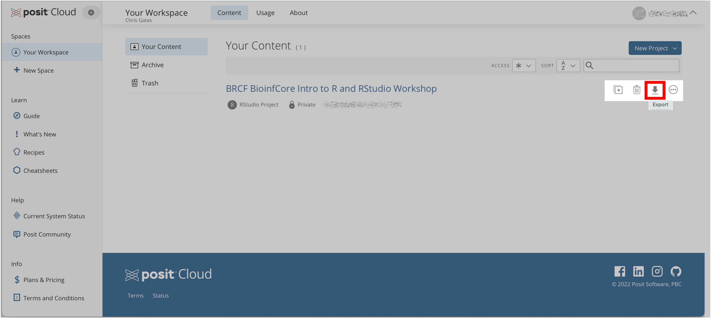

<style type="text/css">

body, td {
   font-size: 18px;
}
code.r{
  font-size: 12px;
}
pre {
  font-size: 12px
}

</style>

```{r, include = FALSE}
source("../bin/set_values.R")
```

```{r klippy, echo=FALSE, include=TRUE}
klippy::klippy(lang = c("r", "markdown", "bash"), position = c("top", "right"))
```

We hope you now have more familiarity with key concepts, tools, and techniques
that will enable more efficient, reproducible, and impactful data research and 
science.


## Session Info

<details>
```{r session_info, eval=FALSE}
################################################################################
# Session info (for reproducibility / future reference)
session_info::session_info()
```

```{verbatim session_info_txt, file='session_info.txt', eval=FALSE}
```
</details>


---

## Housekeeping

- This workshop website (aka "show notes") will be available.

---

### Can I continue to use the RStudio environment we used in the workshop?
- The [PositCloud](https://posit.cloud/){target="_blank"} environment used in 
  this workshop does not expire. 
- You can downloading the workshop files to your own computer by [viewing&nbsp;your&nbsp;workspace](https://posit.cloud/content/yours){target="blank"} 
  and clicking <u>&#x2B07;</u> <kbd>Export</kbd>. Posit-cloud will zip up a 
  downloadable file which you can then expand and use with a local version of RStudio.
  

### Where else could I use RStudio?
  - See [Advanced setup instructions](workshop_setup/setup_instructions_advanced.html){target="_blank"}
    for details on how to install RStudio and required packages on your own computer.

---

### Where can I learn more about RStudio packages and functions?
- A nifty collection of [cheatsheets for R](https://www.rstudio.com/resources/cheatsheets/){target="_blank"} and links to download some our favorites:
  - [Base R](http://github.com/rstudio/cheatsheets/blob/main/base-r.pdf){target="_blank"}   
  - [Data transformation with dplyr](https://raw.githubusercontent.com/rstudio/cheatsheets/main/data-transformation.pdf){target="_blank"}
  - [Data visualization with ggplot2](https://raw.githubusercontent.com/rstudio/cheatsheets/main/data-visualization.pdf){target="_blank"}

---

### Can you recommend other relevant workshops or tutorials?
- The [University of Michigan Bioinformatics Core](https://michmed.org/GqGzZ){target="_blank"} regularly hosts workshops.
- Intro lessons and workshops in Bash / Git / R / Python : 
  - [Software Carpentry](https://software-carpentry.org/lessons/){target="_blank"}
- Some great "practice" datasets 
  - [tidytuesday](https://github.com/rfordatascience/tidytuesday){target="_blank"} : a site for sharing sample datasets
  - [Kaggle](https://www.kaggle.com/datasets){target="_blank"} : a site for learning AI/ML, but you can jump right to the sample datasets &#128521;


### Are there other tools like RStudio that can help me work with R?
- In addition to RStudio, Posit recently developed a new tool called   
  [Positron](https://positron.posit.co/){target="_blank"}. Positron has many of 
  the same features as RStudio but with better support for Python. Like Rstudio, 
  Positron is free.

## Thank you

Thank you for participating in our workshop. We welcome your questions and
feedback now and in the future.

The Workshop Team

[bioinformatics-workshops@umich.edu](mailto:bioinformatics-workshops@umich.edu) <br/>
[UM BRCF Bioinformatics Core](https://medresearch.umich.edu/office-research/about-office-research/biomedical-research-core-facilities/bioinformatics-core){target="_blank"}

<hr/>