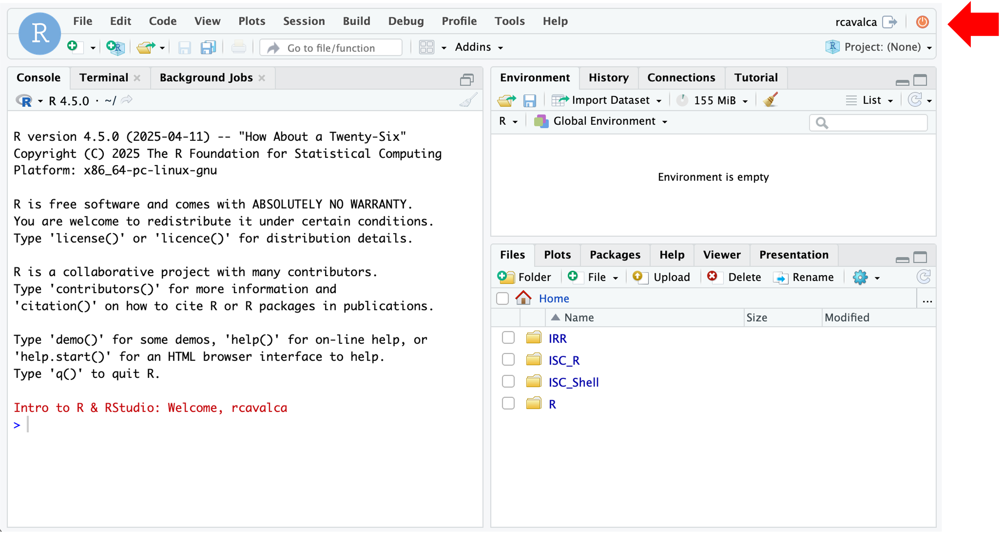

<style type="text/css">
body{ /* Normal  */
      font-size: 14pt;
  }
  
</style>

```{r, include = FALSE}
source("../../bin/set_values.R")
```

This document guides you through the installation of software necessary
to participate in the workshop. To complete
this setup, you will need:

-   A Macintosh or Windows workstation connected to the internet.
-   About 10 minutes.


## Introduction

-   Attendees will use their own workstation/laptop to participate.
-   For simplicity, participants will log in to a pre-built server which
    has the necessary data, software, and configuration already installed.
-   While not required or recommended, advanced users may elect to install some software
    locally; see [advanced setup instructions](setup_instructions_advanced.html).

## How to get help

-   If you have problems/questions, please don't hesitate to email us
    at:
    [bioinformatics-workshops@umich.edu](mailto:bioinformatics-workshops@umich.edu)

-   When emailing it will speed things along if you could include:
    -   Whether you are using Windows or Mac (and optionally which
        version of the OS you are using).
    -   The specific text of any error messages, if applicable.

## Setup steps

### **Posit-Cloud**

 **1.1** If you have not used Zoom before, please use the following link to
install "Zoom client for Meetings"\
[https://zoom.us/download](https://zoom.us/download){target="_blank"}

 You should see a new webpage that looks something like this:

 

 If you see a screen like that above, you have successfully logged into RStudio.

## Congratulations
Your workstation and logins are ready for the workshop; thank you for
   taking time to set this up in advance.

   - You can close your RStudio session by clicking the small orange "power"
     button in the top-right corner (highlighted in the picture above by a red
     arrow).  The webpage will announce **R&nbsp;Session&nbsp;Ended**; you may now close
     the web page.

### A note on the Posit-Cloud compute environment

Please note that this environment is optimized for the exercises in this
particular workshop but is likely unsuitable for analyzing your own
datasets. In particular:
- It is not sized for compute intensive operations or large storage.
- It is not secured for sensitive data of any kind.
- This environment is temporary and will be removed shortly after the
  conclusion of the workshop.

If you had problems or questions about the installation steps
please see the **[How to get help](#how-to-get-help)** section above for
more assistance.
