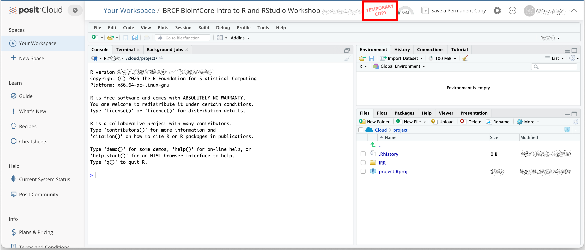
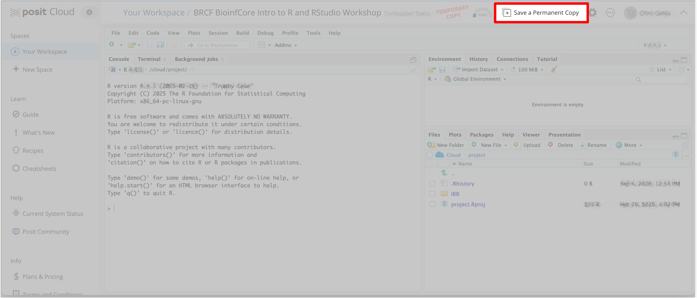
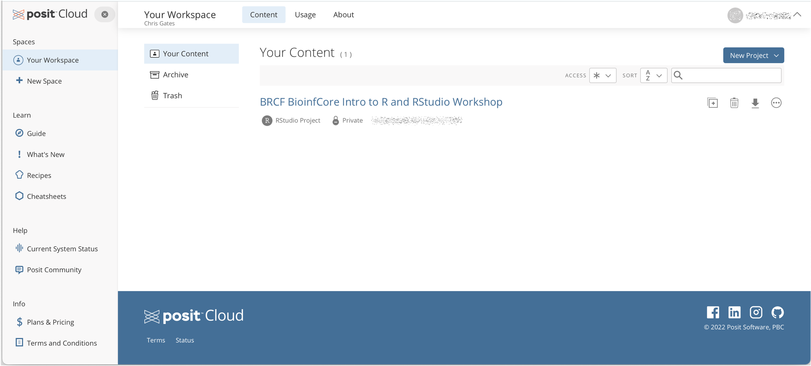
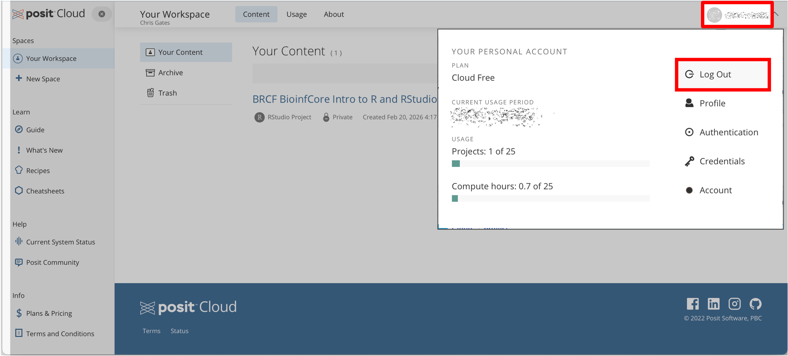

<style type="text/css">
body{ /* Normal  */
      font-size: 14pt;
  }
  
</style>

```{r, include = FALSE}
source("../../bin/set_values.R")
```

This document guides you through the installation of software necessary
to participate in the workshop. To complete
this setup, you will need:

-   A Macintosh or Windows workstation connected to the internet.
-   About 10 minutes.


## Introduction

-   Attendees will use their own workstation/laptop to participate.
-   For simplicity, participants will log in to a pre-built server which
    has the necessary data, software, and configuration already installed.
-   While not required or recommended, advanced users may elect to install some software
    locally on their laptop; see 
    [advanced setup instructions](setup_instructions_advanced.html).

## How to get help

-   If you have problems/questions, please don't hesitate to email us
    at:
    [bioinformatics-workshops@umich.edu](mailto:bioinformatics-workshops@umich.edu)

-   When emailing it will speed things along if you could include the specific 
    text of any error messages.

## Setup steps

For the workshop you will access RStudio though your browser. This service is hosted through PositCloud, so you'll need to register there first:

**1.**  [Register at PositCloud](https://login.posit.cloud/register){target="_blank"}. PositCloud is free for light use. (Paid plans exist for more computationally demanding work.) 

**2.** You can enter you email and a password -or- authenticate through an existing Google or Github account. 

**3.** Once you have created your account, click below to 
[open the workshop workspace](https://posit.cloud/content/10156998){target="_blank"} in your browser.

  - You may need to login.
  - You will see a progress bar "Deploying project"
  - After a few moments, you should see a screen that looks similar to below.
    (You will see the **Temporary Copy** warning at the top of the page; that's ok.)
    

&nbsp; 
**4.** Click <kbd>Save&nbsp;a&nbsp;Permanent&nbsp;Copy</kbd> at the top to copy 
       the workshop template project into your own working area.
       

**5.** After a moment, screen header will refresh and the **Temporary Copy** warning will be gone.

&nbsp;
**6.** Follow this link to see [your copy of the workshop project](https://posit.cloud/content/yours){target="_blank"}.
  

&nbsp;
**7.** You can close and logout of your RStudio session by:
  
  - Clicking your username button in the top-right corner (highlighted in the picture above) 
  - Clicking <kbd>&#x23FB; Log Out</kbd>
  - Close the browser tab. 
     

## Congratulations
You are ready for the workshop; thank you for taking time to set this up in advance.

### A note on the Posit-Cloud compute environment

Please note that this environment is optimized for the exercises in this
particular workshop but is likely unsuitable for analyzing your own
datasets. In particular:
- It is not sized for compute intensive operations or large storage.
- It is not secured for sensitive data of any kind.
- FYI, the workspace you just copied above is available to you after the
  conclusion of the workshop.

If you had problems or questions about the installation steps
please see the **[How to get help](#how-to-get-help)** section above for
more assistance.
